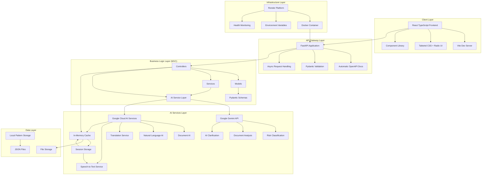
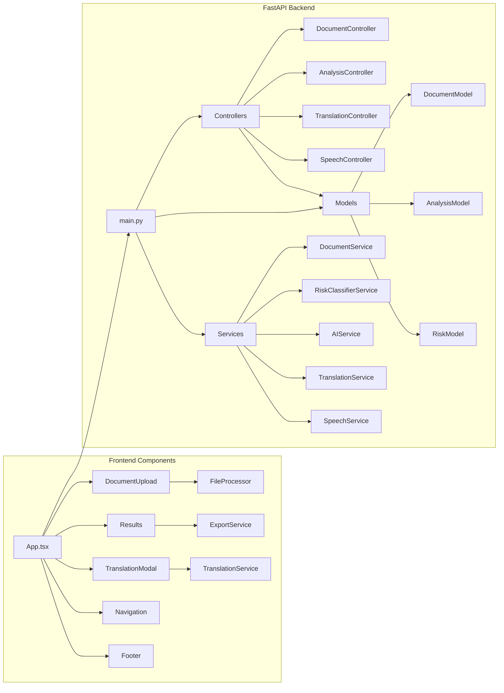

# Legal Saathi Complete Modernization Design

## Overview

This design document outlines the comprehensive modernization of the Legal Saathi Document Advisor application. The modernization involves migrating from Flask to FastAPI with MVC architecture, removing Neo4j dependencies, standardizing on Google's Gemini API, enhancing the React frontend, and updating all deployment configurations. The design ensures improved performance, scalability, maintainability, and alignment with competition evaluation criteria for technical merit, user experience, innovation, and market feasibility.

## Architecture

### High-Level System Architecture



### Detailed Component Architecture



## Components and Interfaces

### 1. FastAPI Backend Architecture (MVC Pattern)

#### Controllers Layer
```python
# controllers/document_controller.py
class DocumentController:
    def __init__(self, document_service: DocumentService):
        self.document_service = document_service
    
    async def analyze_document(self, request: DocumentAnalysisRequest) -> DocumentAnalysisResponse:
        """Handle document analysis requests with async processing"""
        pass
    
    async def get_analysis_status(self, analysis_id: str) -> AnalysisStatusResponse:
        """Get status of ongoing analysis"""
        pass

# controllers/translation_controller.py
class TranslationController:
    async def translate_text(self, request: TranslationRequest) -> TranslationResponse:
        """Handle translation requests"""
        pass
    
    async def translate_clause(self, request: ClauseTranslationRequest) -> ClauseTranslationResponse:
        """Handle clause-level translation"""
        pass

# controllers/speech_controller.py
class SpeechController:
    def __init__(self, speech_service: GoogleCloudSpeechService):
        self.speech_service = speech_service
    
    async def speech_to_text(self, audio_file: UploadFile) -> SpeechToTextResponse:
        """Handle speech-to-text conversion for document input"""
        pass
    
    async def text_to_speech(self, request: TextToSpeechRequest) -> StreamingResponse:
        """Handle text-to-speech conversion for accessibility"""
        pass
    
    async def get_supported_languages(self) -> SupportedLanguagesResponse:
        """Get list of supported languages for speech services"""
        pass
```

#### Models Layer (Pydantic Schemas)
```python
# models/document_models.py
class DocumentAnalysisRequest(BaseModel):
    document_text: str = Field(..., min_length=100, max_length=50000)
    document_type: DocumentType
    user_expertise_level: Optional[ExpertiseLevel] = ExpertiseLevel.BEGINNER
    analysis_options: Optional[AnalysisOptions] = None

class RiskAssessment(BaseModel):
    level: RiskLevel
    score: float = Field(..., ge=0.0, le=1.0)
    reasons: List[str]
    confidence_percentage: int = Field(..., ge=0, le=100)
    risk_categories: Dict[str, float]

class DocumentAnalysisResponse(BaseModel):
    analysis_id: str
    overall_risk: RiskAssessment
    clause_assessments: List[ClauseAnalysis]
    summary: str
    processing_time: float
    recommendations: List[str]

class SpeechToTextRequest(BaseModel):
    language_code: Optional[str] = "en-US"
    enable_punctuation: bool = True

class SpeechToTextResponse(BaseModel):
    transcript: str
    confidence: float
    language_detected: str

class TextToSpeechRequest(BaseModel):
    text: str = Field(..., max_length=5000)
    language_code: Optional[str] = "en-US"
    voice_gender: Optional[str] = "NEUTRAL"
    speaking_rate: Optional[float] = Field(0.9, ge=0.25, le=4.0)

class SupportedLanguagesResponse(BaseModel):
    speech_to_text_languages: List[Dict[str, str]]
    text_to_speech_languages: List[Dict[str, str]]
```

#### Services Layer
```python
# services/ai_service.py
class AIService:
    def __init__(self):
        self.gemini_client = genai.GenerativeModel('gemini-1.5-flash')
        self.fallback_analyzer = KeywordAnalyzer()
    
    async def analyze_risk(self, text: str, document_type: DocumentType) -> RiskAssessment:
        """Analyze risk using Gemini API with fallback"""
        pass
    
    async def get_clarification(self, question: str, context: Dict) -> ClarificationResponse:
        """Provide AI-powered clarification"""
        pass

# services/speech_service.py
class SpeechService:
    def __init__(self):
        self.speech_client = speech.SpeechClient()
        self.tts_client = texttospeech.TextToSpeechClient()
    
    async def speech_to_text(self, audio_data: bytes) -> str:
        """Convert speech to text using Google Cloud Speech-to-Text"""
        pass
    
    async def text_to_speech(self, text: str, language_code: str = "en-US") -> bytes:
        """Convert text to speech using Google Cloud Text-to-Speech"""
        pass

# services/document_service.py
class DocumentService:
    def __init__(self, ai_service: AIService, cache_service: CacheService, speech_service: SpeechService):
        self.ai_service = ai_service
        self.cache_service = cache_service
        self.speech_service = speech_service
    
    async def process_document(self, request: DocumentAnalysisRequest) -> DocumentAnalysisResponse:
        """Main document processing pipeline"""
        pass
```

### 2. React Frontend Enhancement

#### Enhanced Component Structure
```typescript
// components/DocumentUpload.tsx
interface DocumentUploadProps {
  onAnalysisComplete: (result: AnalysisResult) => void;
  onError: (error: ErrorInfo) => void;
}

// components/Results.tsx
interface ResultsProps {
  analysisResult: AnalysisResult;
  onExport: (format: ExportFormat) => void;
  onTranslate: (clause: ClauseAnalysis) => void;
}

// services/apiService.ts
class APIService {
  private baseURL = '/api';
  
  async analyzeDocument(request: DocumentAnalysisRequest): Promise<DocumentAnalysisResponse> {
    // FastAPI integration with proper error handling
  }
  
  async translateClause(clauseId: string, targetLanguage: string): Promise<TranslationResponse> {
    // Enhanced translation service
  }
  
  async speechToText(audioBlob: Blob, languageCode?: string): Promise<SpeechToTextResponse> {
    // Speech-to-text integration for voice input
  }
  
  async textToSpeech(text: string, options?: TextToSpeechOptions): Promise<Blob> {
    // Text-to-speech integration for accessibility
  }
  
  async getSupportedLanguages(): Promise<SupportedLanguagesResponse> {
    // Get supported languages for speech services
  }
}

// components/VoiceInput.tsx
interface VoiceInputProps {
  onTranscript: (text: string) => void;
  onError: (error: string) => void;
  language?: string;
}

// components/AudioPlayer.tsx
interface AudioPlayerProps {
  text: string;
  language?: string;
  autoPlay?: boolean;
}
```

### 3. Google Cloud AI Services Integration

#### Unified AI Service with Speech Support
```python
# services/gemini_service.py
class GeminiService:
    def __init__(self):
        genai.configure(api_key=os.getenv('GEMINI_API_KEY'))
        self.model = genai.GenerativeModel('gemini-1.5-flash')
        self.fallback_service = KeywordBasedAnalyzer()
    
    async def analyze_legal_risk(self, text: str, document_type: str) -> Dict:
        """Primary risk analysis using Gemini"""
        try:
            prompt = self._build_risk_analysis_prompt(text, document_type)
            response = await self.model.generate_content_async(prompt)
            return self._parse_risk_response(response.text)
        except Exception as e:
            logger.warning(f"Gemini API failed: {e}, using fallback")
            return await self.fallback_service.analyze_risk(text, document_type)
    
    async def provide_clarification(self, question: str, context: Dict) -> str:
        """AI-powered clarification service"""
        pass

# services/google_cloud_speech_service.py
class GoogleCloudSpeechService:
    def __init__(self):
        self.speech_client = speech.SpeechClient()
        self.tts_client = texttospeech.TextToSpeechClient()
    
    async def transcribe_audio(self, audio_content: bytes, language_code: str = "en-US") -> str:
        """Convert speech to text for document input"""
        try:
            audio = speech.RecognitionAudio(content=audio_content)
            config = speech.RecognitionConfig(
                encoding=speech.RecognitionConfig.AudioEncoding.WEBM_OPUS,
                sample_rate_hertz=48000,
                language_code=language_code,
                enable_automatic_punctuation=True,
                model="latest_long"
            )
            
            response = self.speech_client.recognize(config=config, audio=audio)
            
            transcript = ""
            for result in response.results:
                transcript += result.alternatives[0].transcript + " "
            
            return transcript.strip()
        except Exception as e:
            logger.error(f"Speech-to-text failed: {e}")
            raise SpeechServiceException(f"Failed to transcribe audio: {str(e)}")
    
    async def synthesize_speech(self, text: str, language_code: str = "en-US") -> bytes:
        """Convert text to speech for accessibility"""
        try:
            synthesis_input = texttospeech.SynthesisInput(text=text)
            
            voice = texttospeech.VoiceSelectionParams(
                language_code=language_code,
                ssml_gender=texttospeech.SsmlVoiceGender.NEUTRAL,
                name=f"{language_code}-Neural2-C"  # Use neural voices for better quality
            )
            
            audio_config = texttospeech.AudioConfig(
                audio_encoding=texttospeech.AudioEncoding.MP3,
                speaking_rate=0.9,  # Slightly slower for legal content
                pitch=0.0
            )
            
            response = self.tts_client.synthesize_speech(
                input=synthesis_input,
                voice=voice,
                audio_config=audio_config
            )
            
            return response.audio_content
        except Exception as e:
            logger.error(f"Text-to-speech failed: {e}")
            raise SpeechServiceException(f"Failed to synthesize speech: {str(e)}")
```

### 4. Caching and Performance Layer

#### In-Memory Caching System
```python
# services/cache_service.py
class CacheService:
    def __init__(self):
        self.analysis_cache = {}
        self.translation_cache = {}
        self.pattern_storage = LocalPatternStorage()
    
    async def get_cached_analysis(self, document_hash: str) -> Optional[DocumentAnalysisResponse]:
        """Retrieve cached analysis results"""
        pass
    
    async def store_analysis(self, document_hash: str, result: DocumentAnalysisResponse):
        """Store analysis results with TTL"""
        pass
    
    async def learn_from_analysis(self, analysis: DocumentAnalysisResponse):
        """Store patterns for future learning (replaces Neo4j)"""
        pass
```

## Data Models

### Core Data Structures

```python
# Pydantic models for type safety and validation
class DocumentType(str, Enum):
    RENTAL_AGREEMENT = "rental_agreement"
    EMPLOYMENT_CONTRACT = "employment_contract"
    NDA = "nda"
    LOAN_AGREEMENT = "loan_agreement"
    PARTNERSHIP_AGREEMENT = "partnership_agreement"
    GENERAL_CONTRACT = "general_contract"

class RiskLevel(str, Enum):
    RED = "RED"      # High risk
    YELLOW = "YELLOW"  # Medium risk
    GREEN = "GREEN"   # Low risk

class ExpertiseLevel(str, Enum):
    BEGINNER = "beginner"
    INTERMEDIATE = "intermediate"
    EXPERT = "expert"

class ClauseAnalysis(BaseModel):
    clause_id: str
    clause_text: str
    risk_assessment: RiskAssessment
    plain_explanation: str
    legal_implications: List[str]
    recommendations: List[str]
    translation_available: bool = False
```

### Database Replacement Strategy

```python
# Local pattern storage to replace Neo4j
class LocalPatternStorage:
    def __init__(self):
        self.patterns_file = "data/risk_patterns.json"
        self.similar_clauses_file = "data/similar_clauses.json"
    
    def store_risk_pattern(self, clause_text: str, risk_assessment: RiskAssessment):
        """Store risk patterns in local JSON files"""
        pass
    
    def find_similar_clauses(self, clause_text: str, limit: int = 5) -> List[Dict]:
        """Find similar clauses using text similarity algorithms"""
        pass
    
    def update_learning_data(self, analysis_result: DocumentAnalysisResponse):
        """Update local learning data"""
        pass
```

## Error Handling

### Comprehensive Error Management

```python
# exceptions/custom_exceptions.py
class LegalSaathiException(Exception):
    """Base exception for Legal Saathi application"""
    pass

class AIServiceException(LegalSaathiException):
    """Exception for AI service failures"""
    pass

class DocumentProcessingException(LegalSaathiException):
    """Exception for document processing failures"""
    pass

class ValidationException(LegalSaathiException):
    """Exception for input validation failures"""
    pass

# middleware/error_handler.py
@app.exception_handler(AIServiceException)
async def ai_service_exception_handler(request: Request, exc: AIServiceException):
    return JSONResponse(
        status_code=503,
        content={
            "error": "AI Service Unavailable",
            "message": "Our AI analysis service is temporarily unavailable. Please try again later.",
            "fallback_available": True,
            "retry_after": 60
        }
    )
```

### Frontend Error Boundaries

```typescript
// components/ErrorBoundary.tsx
class ErrorBoundary extends React.Component<ErrorBoundaryProps, ErrorBoundaryState> {
  constructor(props: ErrorBoundaryProps) {
    super(props);
    this.state = { hasError: false, error: null };
  }

  static getDerivedStateFromError(error: Error): ErrorBoundaryState {
    return { hasError: true, error };
  }

  componentDidCatch(error: Error, errorInfo: React.ErrorInfo) {
    // Log error to monitoring service
    console.error('Error caught by boundary:', error, errorInfo);
  }

  render() {
    if (this.state.hasError) {
      return <ErrorFallback error={this.state.error} onRetry={this.handleRetry} />;
    }

    return this.props.children;
  }
}
```

## Testing Strategy

### Backend Testing (FastAPI)

```python
# tests/test_document_controller.py
@pytest.mark.asyncio
async def test_analyze_document_success():
    """Test successful document analysis"""
    client = TestClient(app)
    
    request_data = {
        "document_text": "Sample rental agreement text...",
        "document_type": "rental_agreement",
        "user_expertise_level": "beginner"
    }
    
    response = client.post("/api/analyze", json=request_data)
    
    assert response.status_code == 200
    assert "analysis_id" in response.json()
    assert "overall_risk" in response.json()

# tests/test_gemini_service.py
@pytest.mark.asyncio
async def test_gemini_risk_analysis():
    """Test Gemini API integration"""
    service = GeminiService()
    
    result = await service.analyze_legal_risk(
        "This clause requires immediate payment...",
        "rental_agreement"
    )
    
    assert result["risk_level"] in ["RED", "YELLOW", "GREEN"]
    assert "confidence_percentage" in result
```

### Frontend Testing

```typescript
// tests/DocumentUpload.test.tsx
describe('DocumentUpload Component', () => {
  test('handles file upload successfully', async () => {
    render(<DocumentUpload onAnalysisComplete={mockCallback} onError={mockError} />);
    
    const fileInput = screen.getByLabelText(/upload document/i);
    const file = new File(['test content'], 'test.pdf', { type: 'application/pdf' });
    
    fireEvent.change(fileInput, { target: { files: [file] } });
    
    await waitFor(() => {
      expect(mockCallback).toHaveBeenCalled();
    });
  });
});
```

### Integration Testing

```python
# tests/test_integration.py
@pytest.mark.asyncio
async def test_full_analysis_pipeline():
    """Test complete document analysis pipeline"""
    # Test React frontend -> FastAPI -> Gemini API -> Response
    pass

@pytest.mark.asyncio
async def test_translation_workflow():
    """Test translation feature end-to-end"""
    # Test clause selection -> translation request -> Google Translate -> UI update
    pass
```

## Performance Optimization

### FastAPI Performance Features

```python
# main.py - FastAPI configuration
app = FastAPI(
    title="Legal Saathi Document Advisor API",
    description="AI-powered legal document analysis platform",
    version="2.0.0",
    docs_url="/docs",
    redoc_url="/redoc"
)

# Add middleware for performance
app.add_middleware(
    CORSMiddleware,
    allow_origins=["http://localhost:3000", "https://legalsaathi-document-advisor.onrender.com"],
    allow_credentials=True,
    allow_methods=["*"],
    allow_headers=["*"],
)

app.add_middleware(GZipMiddleware, minimum_size=1000)

# Add caching middleware
@app.middleware("http")
async def add_cache_headers(request: Request, call_next):
    response = await call_next(request)
    if request.url.path.startswith("/api/"):
        response.headers["Cache-Control"] = "public, max-age=300"  # 5 minutes
    return response
```

### Async Processing

```python
# services/async_document_service.py
class AsyncDocumentService:
    async def process_document_async(self, request: DocumentAnalysisRequest) -> str:
        """Start async document processing and return job ID"""
        job_id = str(uuid.uuid4())
        
        # Start background task
        background_tasks.add_task(self._process_document_background, job_id, request)
        
        return job_id
    
    async def _process_document_background(self, job_id: str, request: DocumentAnalysisRequest):
        """Background processing task"""
        try:
            result = await self.document_service.process_document(request)
            await self.cache_service.store_result(job_id, result)
        except Exception as e:
            await self.cache_service.store_error(job_id, str(e))
```

## Security Considerations

### API Security

```python
# security/rate_limiting.py
from slowapi import Limiter, _rate_limit_exceeded_handler
from slowapi.util import get_remote_address
from slowapi.errors import RateLimitExceeded

limiter = Limiter(key_func=get_remote_address)
app.state.limiter = limiter
app.add_exception_handler(RateLimitExceeded, _rate_limit_exceeded_handler)

@app.post("/api/analyze")
@limiter.limit("10/minute")
async def analyze_document(request: Request, document_request: DocumentAnalysisRequest):
    """Rate-limited document analysis endpoint"""
    pass
```

### Input Validation and Sanitization

```python
# validators/document_validator.py
class DocumentValidator:
    @staticmethod
    def validate_document_text(text: str) -> str:
        """Validate and sanitize document text"""
        if not text or len(text.strip()) < 100:
            raise ValidationException("Document text must be at least 100 characters")
        
        if len(text) > 50000:
            raise ValidationException("Document text exceeds maximum length")
        
        # Remove potentially harmful content
        sanitized_text = html.escape(text)
        return sanitized_text.strip()
```

## Deployment Architecture

### Render Platform Configuration

```yaml
# render.yaml (updated for FastAPI)
services:
  - type: web
    name: legalsaathi-document-advisor
    env: python
    plan: starter  # Upgraded from free for better performance
    buildCommand: |
      # Install Node.js and build frontend
      curl -fsSL https://deb.nodesource.com/setup_18.x | sudo -E bash -
      sudo apt-get install -y nodejs
      cd client && npm ci && npm run build && cd ..
      # Install Python dependencies
      pip install -r requirements.txt
    startCommand: uvicorn main:app --host 0.0.0.0 --port $PORT --workers 2
    envVars:
      - key: ENVIRONMENT
        value: production
      - key: GEMINI_API_KEY
        sync: false
      - key: GOOGLE_TRANSLATE_API_KEY
        sync: false
      - key: GOOGLE_CLOUD_PROJECT_ID
        sync: false
      - key: GOOGLE_CLOUD_LOCATION
        sync: false
      - key: DOCUMENT_AI_PROCESSOR_ID
        sync: false
    healthCheckPath: /health
```

### Docker Configuration

```dockerfile
# Dockerfile (updated for FastAPI)
FROM node:18-alpine as frontend-builder
WORKDIR /app/client
COPY client/package*.json ./
RUN npm ci --only=production
COPY client/ ./
RUN npm run build

FROM python:3.11-slim as backend
WORKDIR /app

# Install system dependencies
RUN apt-get update && apt-get install -y curl && rm -rf /var/lib/apt/lists/*

# Copy requirements and install Python dependencies
COPY requirements.txt .
RUN pip install --no-cache-dir -r requirements.txt

# Copy React build from frontend builder
COPY --from=frontend-builder /app/client/dist ./static/dist

# Copy application code
COPY . .

# Create non-root user
RUN useradd --create-home --shell /bin/bash app && chown -R app:app /app
USER app

EXPOSE 8000

HEALTHCHECK --interval=30s --timeout=30s --start-period=5s --retries=3 \
    CMD curl -f http://localhost:8000/health || exit 1

CMD ["uvicorn", "main:app", "--host", "0.0.0.0", "--port", "8000", "--workers", "2"]
```

## Migration Strategy

### Phase 1: Backend Migration (FastAPI + Gemini)
1. Create FastAPI application structure with MVC pattern
2. Migrate Flask routes to FastAPI endpoints
3. Replace Groq API calls with Gemini API
4. Remove Neo4j dependencies and implement local storage
5. Add comprehensive error handling and validation

### Phase 2: Frontend Enhancement
1. Update API service to work with FastAPI endpoints
2. Enhance UI components with better error handling
3. Implement new features (clause-level translation, improved exports)
4. Add loading states and progress indicators
5. Improve responsive design and accessibility

### Phase 3: Testing and Optimization
1. Implement comprehensive test suite
2. Performance optimization and caching
3. Security hardening
4. Documentation updates

### Phase 4: Deployment and Monitoring
1. Update deployment configurations
2. Deploy to Render platform
3. Set up monitoring and health checks
4. Performance monitoring and optimization

This design ensures a robust, scalable, and maintainable application that meets all competition evaluation criteria while providing an excellent user experience.