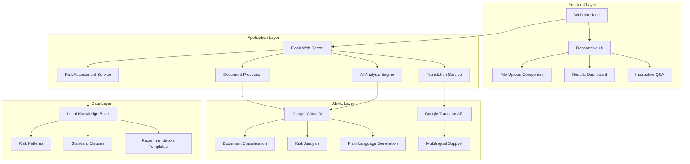
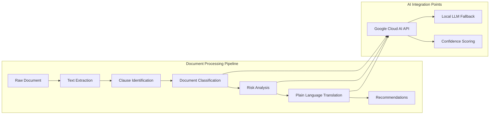
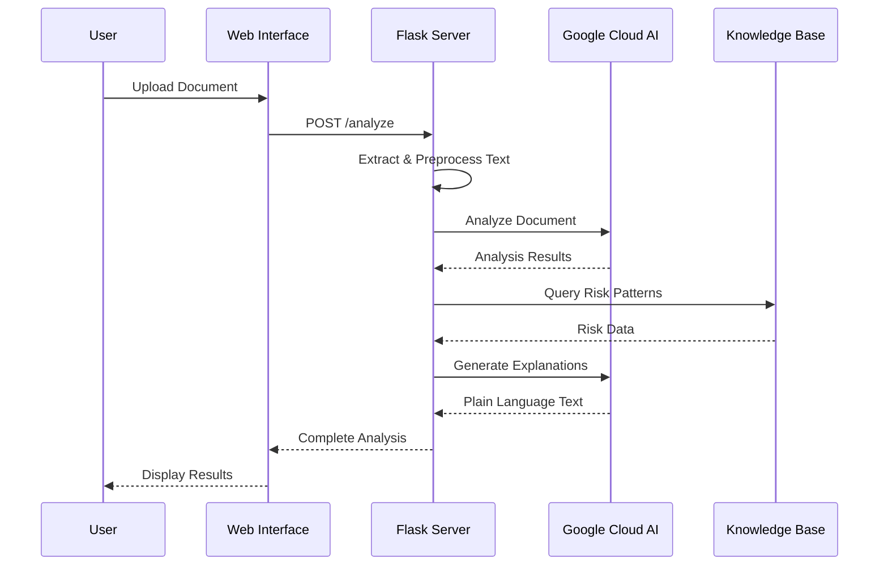
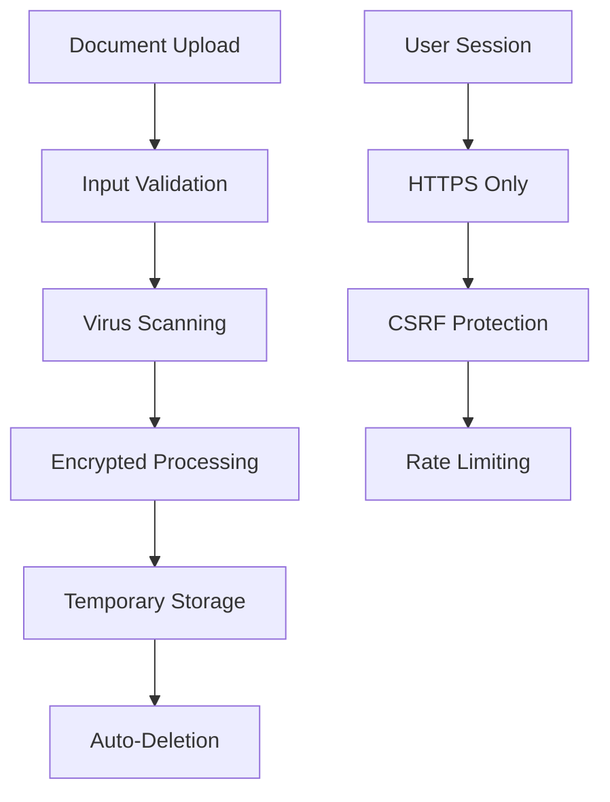

# LegalSaathi Architecture & Technical Notes

## High-Level System Architecture



## Component Architecture



## Google Cloud AI Integration Points

### 1. Document Analysis Service
- **Service**: Vertex AI Text Analysis
- **Purpose**: Extract key clauses and legal concepts
- **Input**: Raw document text
- **Output**: Structured clause data with confidence scores

### 2. Risk Assessment Engine
- **Service**: Vertex AI Custom Model
- **Purpose**: Classify risk levels using legal training data
- **Input**: Clause text + context
- **Output**: Risk level (RED/YELLOW/GREEN) + reasoning

### 3. Plain Language Generator
- **Service**: Vertex AI Generative Models
- **Purpose**: Convert legal jargon to accessible language
- **Input**: Complex legal clause
- **Output**: Plain English explanation + examples

### 4. Translation Service
- **Service**: Google Translate API
- **Purpose**: Multi-language support for global accessibility
- **Input**: Analysis results in English
- **Output**: Translated content in user's preferred language

## Technical Stack Details

### Backend Technologies
```
Flask 2.3.x          # Web framework
Python 3.9+          # Runtime environment
Google Cloud SDK     # AI service integration
PyPDF2              # PDF text extraction
Werkzeug            # File upload handling
```

### Frontend Technologies
```
HTML5/CSS3          # Structure and styling
Bootstrap 5.x       # Responsive framework
JavaScript ES6+     # Interactive functionality
Chart.js           # Risk visualization
```

### AI/ML Components
```
Google Vertex AI    # Primary AI service
Transformers       # Local model fallback
NLTK               # Text preprocessing
spaCy              # Named entity recognition
```

## Data Flow Architecture



## Scalability Considerations

### Horizontal Scaling
- **Load Balancing**: Nginx reverse proxy for multiple Flask instances
- **Caching**: Redis for frequently analyzed document patterns
- **Queue System**: Celery for background AI processing

### Performance Optimization
- **Async Processing**: Background analysis for large documents
- **Caching Strategy**: Cache common clause analyses
- **CDN Integration**: Static asset delivery optimization

### Cost Management
- **API Rate Limiting**: Prevent excessive Google Cloud API calls
- **Batch Processing**: Group similar analyses
- **Fallback Models**: Local models for basic analysis when API limits reached

## Security Architecture

### Data Protection


### Privacy Measures
- **No Persistent Storage**: Documents deleted after analysis
- **Encryption**: All data encrypted in transit and at rest
- **Anonymization**: Remove PII before AI processing
- **Audit Logging**: Track access without storing content

## Deployment Architecture

### Development Environment
```
Local Flask Server → Google Cloud AI APIs → Local Testing
```

### Production Environment
```
Nginx → Gunicorn → Flask App → Google Cloud AI → Monitoring
```

### Free Tier Deployment Options
1. **Heroku Free Tier** + Google Cloud AI free credits
2. **Railway** + Google Cloud integration
3. **Render** + Vertex AI free tier
4. **Google Cloud Run** (free tier) + native AI integration

## Monitoring & Analytics

### Performance Metrics
- Response time per document type
- AI service accuracy rates
- User satisfaction scores
- Error rates and types

### Business Metrics
- Document types analyzed
- Risk levels identified
- User engagement patterns
- Feature usage statistics

## Innovation Highlights

### Technical Innovation
- **Hybrid AI Approach**: Cloud AI + local fallback for reliability
- **Context-Aware Analysis**: Document type detection improves accuracy
- **Confidence Scoring**: Transparency in AI decision-making
- **Real-time Processing**: Sub-30 second analysis for most documents

### User Experience Innovation
- **Progressive Disclosure**: Show results as they're generated
- **Interactive Explanations**: Click for deeper understanding
- **Visual Risk Indicators**: Traffic light system for quick comprehension
- **Multilingual Support**: Accessibility for diverse communities

## Future Architecture Enhancements

### Phase 2 Additions
- **Machine Learning Pipeline**: Custom model training on legal data
- **Document Comparison**: Side-by-side contract analysis
- **Legal Expert Network**: Human verification for complex cases
- **API Ecosystem**: Third-party integrations for legal services

### Scalability Roadmap
- **Microservices**: Break into specialized services
- **Event-Driven Architecture**: Async processing pipeline
- **Multi-Cloud**: Reduce vendor lock-in
- **Edge Computing**: Regional processing for faster response