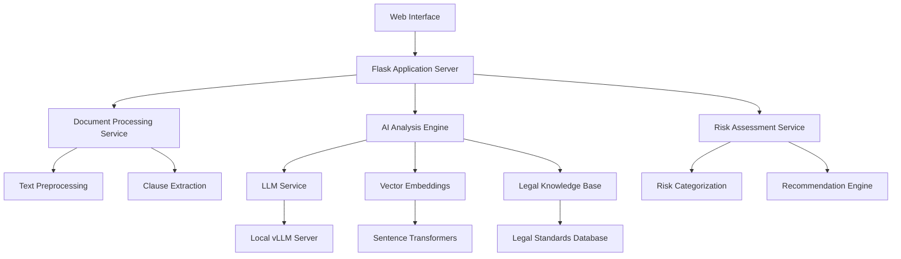

# Design Document

## Overview

LegalSaathi Document Advisor is designed as a web-based AI platform that transforms complex rental agreements into accessible insights for citizens. The system leverages advanced NLP models, vector embeddings, and a comprehensive legal knowledge base to provide real-time document analysis with risk assessment and plain-language explanations.

The architecture builds upon proven technologies including Flask for the web framework, sentence transformers for embeddings, and LLM integration for intelligent analysis, while introducing specialized components for legal document processing and risk assessment.

## Architecture

### High-Level Architecture



### Technology Stack

**Frontend:**
- HTML5/CSS3 with responsive design
- JavaScript for dynamic interactions
- Bootstrap for UI components

**Backend:**
- Flask web framework (Python)
- Gunicorn WSGI server for production
- RESTful API design

**AI/ML Components:**
- Local vLLM server with Llama-3.1-8B-Instruct
- Sentence Transformers for embeddings
- Custom legal document analysis models
- Vector similarity search

**Data Storage:**
- In-memory processing for privacy
- Temporary session storage
- Legal knowledge base (JSON/SQLite)

**Infrastructure:**
- Docker containers for deployment
- Nginx reverse proxy
- SSL/TLS encryption

## Components and Interfaces

### 1. Web Interface Layer

**DocumentInputComponent**
- Purpose: Provides user interface for document submission
- Interface: Simple textarea with validation and character limits
- Features: Real-time character count, paste detection, format validation

**AnalysisResultsComponent**
- Purpose: Displays analysis results with traffic light system
- Interface: Structured layout with expandable sections
- Features: Risk indicators, clause highlighting, plain-language explanations

**RecommendationsComponent**
- Purpose: Shows actionable recommendations and next steps
- Interface: Prioritized list with action buttons
- Features: Sample language suggestions, negotiation tips

### 2. Document Processing Service

**TextPreprocessor**
```python
class TextPreprocessor:
    def clean_text(self, raw_text: str) -> str
    def validate_rental_agreement(self, text: str) -> bool
    def extract_metadata(self, text: str) -> dict
```

**ClauseExtractor**
```python
class ClauseExtractor:
    def identify_clauses(self, text: str) -> List[Clause]
    def categorize_clause_types(self, clauses: List[Clause]) -> dict
    def extract_key_terms(self, clause: Clause) -> List[str]
```

### 3. AI Analysis Engine

**LegalAnalyzer**
```python
class LegalAnalyzer:
    def analyze_document(self, document: str) -> AnalysisResult
    def compare_against_standards(self, clause: Clause) -> ComparisonResult
    def generate_explanation(self, clause: Clause) -> str
```

**EmbeddingService**
```python
class EmbeddingService:
    def embed_clause(self, clause: str) -> List[float]
    def find_similar_standards(self, clause_embedding: List[float]) -> List[Standard]
    def calculate_similarity(self, emb1: List[float], emb2: List[float]) -> float
```

### 4. Risk Assessment Service

**RiskClassifier**
```python
class RiskClassifier:
    def classify_risk_level(self, clause: Clause, analysis: AnalysisResult) -> RiskLevel
    def identify_red_flags(self, clause: Clause) -> List[RedFlag]
    def calculate_overall_risk(self, document_analysis: DocumentAnalysis) -> OverallRisk
```

**RecommendationEngine**
```python
class RecommendationEngine:
    def generate_recommendations(self, risk_assessment: RiskAssessment) -> List[Recommendation]
    def suggest_clause_improvements(self, clause: Clause) -> List[Improvement]
    def create_negotiation_points(self, high_risk_clauses: List[Clause]) -> List[NegotiationPoint]
```

## Data Models

### Core Data Models

```python
@dataclass
class Clause:
    id: str
    text: str
    clause_type: str
    start_position: int
    end_position: int
    key_terms: List[str]

@dataclass
class RiskLevel:
    level: str  # "RED", "YELLOW", "GREEN"
    score: float  # 0.0 to 1.0
    reasons: List[str]
    severity: str

@dataclass
class AnalysisResult:
    clause_id: str
    risk_level: RiskLevel
    plain_explanation: str
    legal_implications: List[str]
    recommendations: List[str]
    similar_standards: List[str]

@dataclass
class DocumentAnalysis:
    document_id: str
    clauses: List[Clause]
    analysis_results: List[AnalysisResult]
    overall_risk: RiskLevel
    summary: str
    processing_time: float
```

### Legal Knowledge Base Schema

```python
@dataclass
class LegalStandard:
    id: str
    category: str  # "rent_amount", "security_deposit", "termination", etc.
    standard_text: str
    risk_indicators: List[str]
    fair_practice_guidelines: str
    embedding: List[float]

@dataclass
class RedFlagPattern:
    pattern_id: str
    description: str
    regex_pattern: str
    risk_level: str
    explanation: str
    recommendation: str
```

## Error Handling

### Error Categories and Responses

**Input Validation Errors**
- Invalid document format: Return structured error with guidance
- Document too long: Provide character limit information
- Empty input: Prompt for valid document

**Processing Errors**
- AI service unavailable: Graceful degradation with basic analysis
- Timeout errors: Partial results with retry option
- Memory errors: Document chunking and progressive processing

**System Errors**
- Database connection issues: Cached responses where possible
- Network errors: Offline mode with limited functionality
- Authentication errors: Clear error messages and recovery steps

### Error Response Format

```python
@dataclass
class ErrorResponse:
    error_code: str
    message: str
    user_friendly_message: str
    suggested_actions: List[str]
    retry_possible: bool
```

## Testing Strategy

### Unit Testing
- **Document Processing**: Test clause extraction, text preprocessing, validation
- **AI Components**: Mock LLM responses, test embedding generation, similarity calculations
- **Risk Assessment**: Test classification logic, recommendation generation
- **API Endpoints**: Test all Flask routes with various input scenarios

### Integration Testing
- **End-to-End Document Flow**: Submit document → process → analyze → return results
- **AI Service Integration**: Test LLM connectivity, embedding service, knowledge base queries
- **Error Handling**: Test graceful degradation, timeout handling, recovery mechanisms

### Performance Testing
- **Load Testing**: Simulate multiple concurrent document analyses
- **Response Time**: Ensure sub-30-second processing for standard documents
- **Memory Usage**: Test with large documents, monitor memory consumption
- **Scalability**: Test system behavior under increasing load

### Security Testing
- **Input Sanitization**: Test XSS prevention, injection attacks
- **Data Privacy**: Verify no persistent storage of sensitive documents
- **Encryption**: Test data in transit and at rest
- **Authentication**: Test session management and access controls

### User Acceptance Testing
- **Usability**: Test with non-technical users, gather feedback on interface
- **Accuracy**: Validate AI analysis results against legal expert reviews
- **Performance**: Real-world testing with actual rental agreements
- **Mobile Compatibility**: Test responsive design across devices

## Implementation Phases

### Phase 1: Core Infrastructure (MVP)
- Basic Flask application setup
- Document input interface
- Simple clause extraction
- Basic risk classification (rule-based)
- Plain-language explanation generation

### Phase 2: AI Integration
- LLM service integration
- Vector embedding implementation
- Legal knowledge base creation
- Advanced risk assessment
- Recommendation engine

### Phase 3: Enhancement and Optimization
- Performance optimization
- Advanced UI features
- Mobile responsiveness
- Comprehensive testing
- Security hardening

### Phase 4: Production Deployment
- Docker containerization
- CI/CD pipeline setup
- Monitoring and logging
- User feedback collection
- Iterative improvements