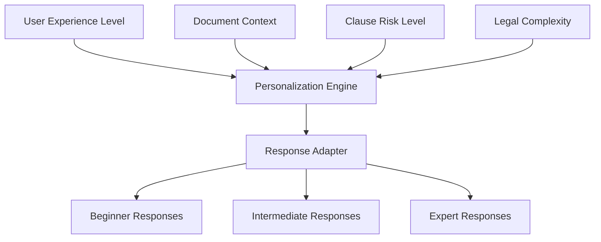
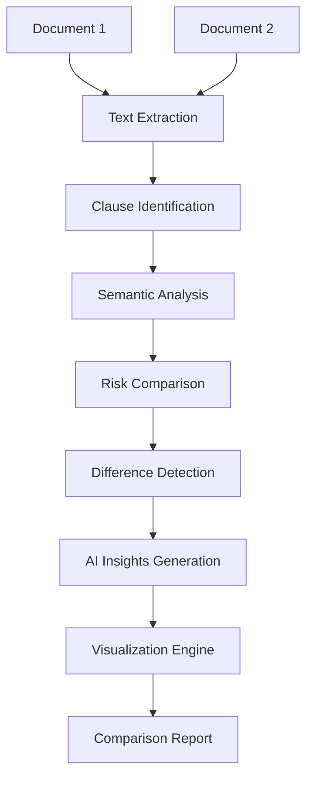
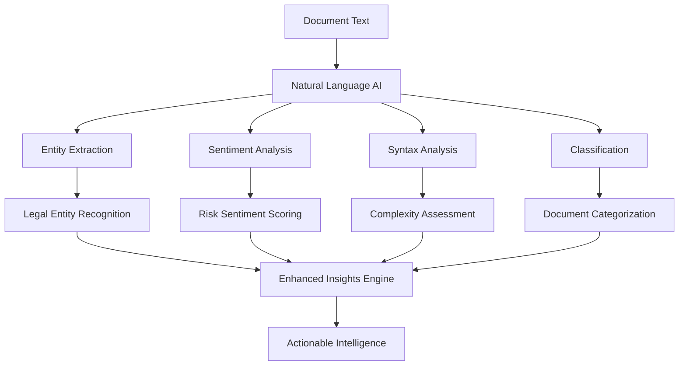
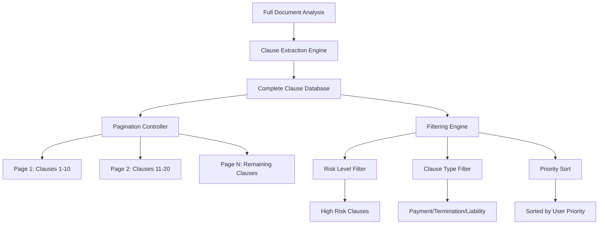

# LegalSaathi Enhancement Design Document

## Overview

This design document outlines the technical architecture and implementation approach for enhancing LegalSaathi with improved Google Cloud AI integration, personalized user experiences, functional document comparison, advanced Natural Language AI utilization, and comprehensive document coverage with pagination/filtering capabilities.

## Architecture

### Enhanced Google Cloud AI Integration

#### Gemini API Migration with Robust Error Handling
- **Current State**: Using Groq API for language model operations
- **Target State**: Migrate to Google Gemini API with comprehensive error handling
- **Implementation**: 
  - Replace Groq client with Gemini API client in `AIService`
  - Implement robust error handling and fallback mechanisms
  - Add proper authentication and cost monitoring to prevent quota exhaustion
  - Create intelligent retry logic and graceful degradation

#### API Gateway Integration
- **Purpose**: Centralize API management, security, and monitoring
- **Components**:
  - Google Cloud API Gateway for request routing
  - Rate limiting and authentication at gateway level
  - Request/response transformation
  - Monitoring and analytics integration

### Experience Level Personalization Architecture

#### Personalization Engine


#### Response Adaptation Strategy
- **Beginner Level**: 
  - Simple language, step-by-step explanations
  - Extensive definitions of legal terms
  - Practical examples and analogies
  - Clear action recommendations
- **Intermediate Level**:
  - Balanced technical and plain language
  - Contextual legal explanations
  - Risk-benefit analysis
  - Alternative options presentation
- **Expert Level**:
  - Technical legal terminology
  - Detailed statutory references
  - Comprehensive risk analysis
  - Professional recommendations

### Document Comparison Enhancement

#### Comparison Engine Architecture


#### Advanced Comparison Features
- **Semantic Similarity**: Use Vertex AI embeddings for clause matching
- **Risk Differential Analysis**: Compare risk scores across similar clauses
- **Change Impact Assessment**: Analyze implications of document differences
- **Visual Diff Presentation**: Side-by-side comparison with highlighting
- **Export Capabilities**: PDF reports with detailed analysis

### Advanced Natural Language AI Enhancement

#### Enhanced Analysis Pipeline


#### Advanced Insights Features
- **Legal Entity Relationships**: Map connections between parties, obligations, and rights
- **Conflict Detection**: Identify contradictory clauses within documents
- **Bias Analysis**: Detect potentially unfavorable language patterns
- **Negotiation Points**: Suggest specific areas for contract improvement
- **Compliance Checking**: Flag potential regulatory compliance issues

### Comprehensive Document Coverage Architecture

#### Pagination and Filtering System


## Components and Interfaces

### Enhanced AI Service Interface

```python
class EnhancedAIService:
    def __init__(self):
        self.gemini_client = GeminiAPIClient()
        self.personalization_engine = PersonalizationEngine()
        self.cost_monitor = CostMonitor()
        self.error_handler = RobustErrorHandler()
        self.fallback_service = IntelligentFallbackService()
    
    async def get_personalized_clarification(
        self, 
        request: ClarificationRequest,
        experience_level: ExperienceLevel
    ) -> PersonalizedClarificationResponse:
        pass
    
    async def analyze_with_gemini_api(
        self, 
        document_text: str,
        analysis_type: AnalysisType
    ) -> GeminiAnalysisResponse:
        pass
```

### Document Comparison Service Interface

```python
class EnhancedComparisonService:
    def __init__(self):
        self.semantic_analyzer = SemanticAnalyzer()
        self.diff_engine = DifferenceEngine()
        self.visualization_service = VisualizationService()
    
    async def compare_documents_advanced(
        self,
        request: AdvancedComparisonRequest
    ) -> AdvancedComparisonResponse:
        pass
    
    async def generate_comparison_report(
        self,
        comparison_id: str,
        format: ReportFormat
    ) -> ComparisonReport:
        pass
```

### Enhanced Natural Language Service Interface

```python
class EnhancedNaturalLanguageService:
    def __init__(self):
        self.insights_engine = LegalInsightsEngine()
        self.conflict_detector = ConflictDetector()
        self.bias_analyzer = BiasAnalyzer()
    
    async def generate_actionable_insights(
        self,
        document_text: str
    ) -> ActionableInsights:
        pass
    
    async def detect_document_conflicts(
        self,
        clauses: List[ClauseAnalysis]
    ) -> ConflictAnalysis:
        pass
```

### Pagination and Filtering Interface

```python
class DocumentPaginationService:
    def __init__(self):
        self.clause_extractor = ComprehensiveClauseExtractor()
        self.filter_engine = ClauseFilterEngine()
        self.sort_engine = ClauseSortEngine()
    
    async def get_paginated_clauses(
        self,
        document_id: str,
        page: int,
        page_size: int,
        filters: ClauseFilters,
        sort_by: SortCriteria
    ) -> PaginatedClauseResponse:
        pass
```

## Data Models

### Enhanced Request/Response Models

```python
class ExperienceLevel(str, Enum):
    BEGINNER = "beginner"
    INTERMEDIATE = "intermediate"
    EXPERT = "expert"

class PersonalizedClarificationRequest(BaseModel):
    question: str
    context: DocumentContext
    experience_level: ExperienceLevel
    conversation_id: Optional[str]
    user_preferences: Optional[UserPreferences]

class AdvancedComparisonRequest(BaseModel):
    document1_text: str
    document2_text: str
    document1_type: str
    document2_type: str
    comparison_focus: List[ComparisonFocus]
    analysis_depth: AnalysisDepth

class ActionableInsights(BaseModel):
    entity_relationships: List[EntityRelationship]
    conflict_analysis: ConflictAnalysis
    bias_indicators: List[BiasIndicator]
    negotiation_points: List[NegotiationPoint]
    compliance_flags: List[ComplianceFlag]

class PaginatedClauseResponse(BaseModel):
    clauses: List[ClauseAnalysis]
    total_clauses: int
    current_page: int
    total_pages: int
    has_more: bool
    filters_applied: ClauseFilters
    sort_criteria: SortCriteria
```

## Error Handling

### Gemini API Error Handling
- **Quota Exceeded**: Implement exponential backoff and fallback to cached responses with user notification
- **Authentication Failures**: Automatic credential refresh and detailed error logging
- **API Unresponsive**: Intelligent fallback to keyword-based responses instead of hardcoded messages
- **Rate Limiting**: Smart request queuing and batching with cost monitoring
- **Response Failures**: Comprehensive logging and debugging capabilities for troubleshooting

### API Gateway Error Handling
- **Gateway Timeouts**: Client-side retry logic with circuit breaker pattern
- **Authentication Errors**: Token refresh and re-authentication flows
- **Rate Limit Exceeded**: User notification and request queuing

### Comparison Service Error Handling
- **Document Processing Failures**: Partial comparison with error reporting
- **Memory Limitations**: Chunked processing for large documents
- **Analysis Timeouts**: Progressive analysis with intermediate results

## Testing Strategy

### Unit Testing
- **AI Service Tests**: Mock Vertex AI responses for consistent testing
- **Personalization Tests**: Validate response adaptation for each experience level
- **Comparison Tests**: Test document difference detection accuracy
- **Pagination Tests**: Verify correct clause extraction and filtering

### Integration Testing
- **Google Cloud Integration**: Test actual API calls with test credentials
- **End-to-End Workflows**: Complete user journeys from upload to analysis
- **Performance Testing**: Load testing with large documents and concurrent users

### User Acceptance Testing
- **Experience Level Validation**: User studies to validate personalization effectiveness
- **Comparison Accuracy**: Legal expert validation of comparison results
- **Usability Testing**: Interface testing for pagination and filtering features

## Performance Considerations

### Analysis Performance Optimization
- **Target Performance**: Complete document analysis within 30 seconds for 50-page documents
- **Parallel Processing**: Analyze multiple clauses concurrently using asyncio and thread pools
- **API Optimization**: Use Groq API as primary service (1-2 second response) instead of Gemini (9-11 seconds)
- **Batch Processing**: Group similar clauses for batch analysis to reduce API calls
- **Smart Caching**: Cache analysis results by clause content hash to avoid re-processing identical clauses

### Output Quality Enhancement
- **Concise Summaries**: Limit clause summaries to 200 words maximum with structured format
- **Executive Summaries**: Generate document-level summaries with risk breakdown, key insights, and recommendations
- **Structured Output**: Use consistent formatting with clear sections (Risks, Recommendations, Key Terms)
- **No Content Duplication**: Summaries should provide insights, not reprint original clause text
- **Actionable Language**: Focus on specific recommendations and negotiation points

### Gemini API Optimization
- **Model Selection**: Choose appropriate Gemini model variants for different tasks
- **Request Batching**: Combine multiple analysis requests where possible
- **Caching Strategy**: Cache model responses for similar document patterns
- **Cost Optimization**: Monitor and optimize token usage to prevent quota exhaustion
- **Error Recovery**: Implement intelligent retry mechanisms and fallback strategies

### Document Processing Optimization
- **Streaming Analysis**: Process large documents in chunks
- **Parallel Processing**: Concurrent analysis of different document sections
- **Memory Management**: Efficient handling of large document datasets
- **Database Optimization**: Indexed storage for quick clause retrieval

### Frontend Performance
- **Virtual Scrolling**: Efficient rendering of large clause lists
- **Progressive Loading**: Load additional clauses on demand
- **Client-Side Caching**: Cache filtered and sorted results
- **Optimistic Updates**: Immediate UI feedback for user interactions

## Security Considerations

### Google Cloud Security
- **Service Account Management**: Principle of least privilege for API access
- **API Key Rotation**: Automated rotation of authentication credentials
- **Audit Logging**: Comprehensive logging of all AI service interactions
- **Data Encryption**: End-to-end encryption for document processing

### Document Privacy
- **Temporary Processing**: No persistent storage of user documents
- **Data Sanitization**: Remove sensitive information from logs
- **Access Controls**: Role-based access to comparison and analysis features
- **Compliance**: GDPR and other privacy regulation compliance

## Deployment Strategy

### Phased Rollout
1. **Phase 1**: Vertex AI migration with feature flag
2. **Phase 2**: Experience level personalization
3. **Phase 3**: Enhanced document comparison
4. **Phase 4**: Advanced Natural Language insights
5. **Phase 5**: Comprehensive pagination and filtering

### Monitoring and Observability
- **Cost Monitoring**: Real-time tracking of Google Cloud AI costs
- **Performance Metrics**: Response times and accuracy measurements
- **User Analytics**: Feature usage and satisfaction metrics
- **Error Tracking**: Comprehensive error monitoring and alerting