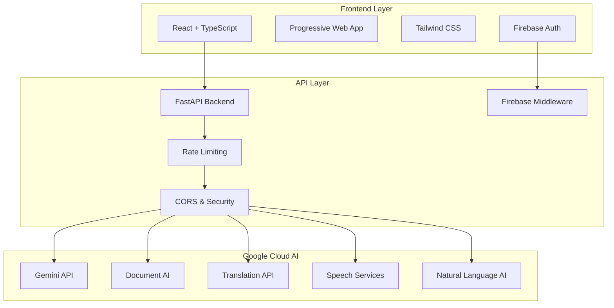

# Legal Saathi Document Advisor

[](https://opensource.org/licenses/MIT)
[](https://www.python.org/downloads/)
[](https://fastapi.tiangolo.com/)
[](https://reactjs.org/)
[](https://cloud.google.com/ai)
[](https://cloud.google.com/run)

**Empowering everyone to understand legal documents through AI**

Legal Saathi is a comprehensive AI-powered platform that transforms complex legal documents into clear, accessible guidance. Built with multiple Google Cloud AI services and deployed on Google Cloud Run, it democratizes legal understanding for everyday citizens and small business owners.

**Live Application**: [https://legal-saathi-432423686849.us-central1.run.app](https://legal-saathi-432423686849.us-central1.run.app)

## Complete Application Workflow

### Authentication & User Management
Firebase Authentication provides secure email/password login, user registration, and profile management. All API endpoints are protected with Firebase middleware, and the system implements user-based rate limiting with different limits for authenticated vs anonymous users.

### Document Input Methods
The platform supports multiple input methods including direct text paste/typing, file uploads (PDF, DOC, DOCX, TXT), image uploads (JPEG, PNG, WEBP, BMP, GIF) using Google Cloud Vision API, speech-to-text conversion using Google Cloud Speech-to-Text, and batch processing of multiple document images.

### Privacy-First Processing
The system includes a comprehensive data masking service that automatically detects and masks PII (names, emails, phone numbers, addresses, SSNs). Privacy compliance validation ensures GDPR compliance before cloud processing. All cloud AI services receive only masked data, and results are unmasked for user display while maintaining complete audit trails.

### AI-Powered Document Analysis
**Google Cloud AI Services Integration:**
Document AI provides OCR and structured document processing, while Cloud Vision API handles text extraction from images with preprocessing. Natural Language AI performs entity extraction, sentiment analysis, and legal insights. Gemini AI delivers advanced document analysis and risk assessment, Groq API serves as the fast primary AI service, and Vertex AI enables semantic search across documents.

**Analysis Pipeline:**
The system provides comprehensive risk assessment with RED/YELLOW/GREEN classification and confidence scores. Individual clauses receive detailed breakdown with plain language explanations. The platform identifies potential legal consequences and provides actionable advice based on risk levels, enhanced by advanced RAG (Retrieval Augmented Generation) integration.

### Multi-Language Support
Google Cloud Translate supports 50+ languages with legal context-aware translation that preserves legal terminology accuracy. The system provides complete document summary translation and clause-level translation with proper legal context preservation.

### Voice Accessibility
Google Cloud Speech-to-Text enables document input via voice, while Google Cloud Text-to-Speech provides audio explanations. The platform offers neural voice options with adjustable parameters across multiple languages and maintains full WCAG 2.1 AA compliance for accessibility.

### Confidence Calculation & Human-in-the-Loop
**AI Confidence Assessment:**
The system uses weighted confidence scoring that combines clause analysis (40%), document summary (30%), and risk assessment (30%). Individual confidence thresholds are set for each analysis component, with overall confidence calculated as a weighted average with penalties for missing components.

**Expert Review Routing:**
Documents with less than 60% confidence are automatically routed to experts through a threshold-based routing system. The expert queue system maintains a database-persistent queue with FIFO ordering, priority management (HIGH/MEDIUM/LOW), and complete status tracking through PENDING → IN_REVIEW → COMPLETED → DELIVERED workflow.

### Advanced Features
**Document Comparison:**
The platform enables side-by-side analysis to compare multiple documents, with change tracking that provides version history and difference highlighting, plus impact assessment analyzing changes between document versions.

**Interactive AI Assistant:**
Context-aware Q&A powered by Gemini AI includes conversation memory and clause-specific chat functionality. The system adapts explanations based on user experience level (Beginner/Intermediate/Expert) and provides smart follow-up question recommendations.

**Advanced RAG Integration:**
The system maintains a knowledge base of legal precedents and standard clauses, providing enhanced insights through context-aware recommendations and similarity matching against known legal patterns.

### Export & Services
The platform provides enhanced PDF export with professional reports featuring risk visualization, charts, and branding. Word document export delivers structured analysis in DOCX format. Email integration through Gmail API and SMTP handles notifications and report delivery, while cost monitoring provides internal usage tracking and quota management for administrators.

### Performance & Optimization
Multi-level caching includes response caching, embedding caching, and translation caching. The system uses parallel processing for concurrent clause analysis and API calls, implements user-based and service-based rate limiting, includes circuit breakers for automatic failover between AI services, and provides load balancing with multiple API keys and automatic rotation.

### Quality Assurance
Response validation ensures quality checks for AI-generated content. Multiple fallback layers handle service failures, comprehensive error handling provides user-friendly messages, and complete audit logging maintains trails for privacy and compliance requirements.

## Complete User Journey
1. **Login** → Firebase Authentication
2. **Upload Document** → Text/File/Image/Speech input
3. **Privacy Protection** → Automatic PII masking
4. **AI Analysis** → Multi-service AI processing with masked data
5. **Risk Assessment** → Confidence calculation and expert routing decision
6. **Results Display** → Unmasked results with interactive features
7. **Translation (optional)** → Multi-language support
8. **Voice Output (optional)** → Text-to-speech explanations
9. **Expert Review (if needed)** → Human-in-the-loop for low confidence
10. **Export** → PDF/Word reports with professional formatting

This workflow ensures privacy-first processing, high-quality AI analysis, accessibility compliance, and expert oversight when needed, making legal documents accessible to everyone while maintaining professional standards.

## Key Features

### Intelligent Document Analysis
- Upload PDFs, DOCs, DOCX, TXT, and images
- AI-powered extraction of key clauses and terms using Google Document AI
- Plain-language explanations of complex legal jargon
- Risk assessment with severity levels and recommendations
- Fairness and complexity scoring with Google Natural Language AI

### Multi-Language Translation
- Support for 50+ languages using Google Cloud Translate
- Legal context-aware translation with cultural adaptation
- Bidirectional translation with confidence scoring
- Clause-level translation for precise legal understanding

### Voice Accessibility
- Speech-to-text for document input using Google Cloud Speech-to-Text
- Text-to-speech for audio explanations using Google Cloud Text-to-Speech
- Neural voice options with multiple languages
- Adjustable speaking rate and pitch for legal content
- Full accessibility compliance (WCAG 2.1 AA)

### Document Comparison
- Side-by-side contract analysis with AI-powered insights
- Change tracking and impact assessment
- Version history management
- Similarity scoring and difference highlighting

### AI Assistant
- Interactive Q&A powered by Google Gemini AI
- Context-aware clarifications with conversation memory
- Follow-up question suggestions
- Conversation analytics and learning patterns

### Expert Integration
- Direct connection to legal professionals
- Expert verification of AI analysis
- Consultation scheduling and referral system

### Authentication & Security
- Firebase authentication with email/password
- User registration and profile management
- Protected routes and API endpoints
- Session management and token refresh

## Architecture

### System Overview


### Technology Stack

#### **Frontend**
- **React 18** - Modern UI framework with concurrent features
- **TypeScript** - Type-safe JavaScript for better DX
- **Vite** - Lightning-fast build tool and dev server
- **Tailwind CSS** - Utility-first CSS framework
- **Firebase SDK** - Authentication and user management
- **Progressive Web App** - Native app experience

#### **Backend**
- **FastAPI** - Modern Python web framework with auto-docs
- **Uvicorn** - High-performance ASGI server
- **Pydantic** - Data validation and serialization
- **SlowAPI** - Rate limiting and security middleware
- **Firebase Admin SDK** - Server-side authentication

#### **AI Services (Google Cloud)**
- **Gemini API** - Advanced language model for document analysis
- **Document AI** - OCR and document processing
- **Translation API** - Neural machine translation
- **Speech-to-Text** - Accurate speech recognition
- **Text-to-Speech** - Natural voice synthesis
- **Natural Language AI** - Text analysis and understanding

## Architecture Overview

### Service Organization
```
LegalSaathi/
├── main.py                     # FastAPI application entry point
├── controllers/                # API endpoint controllers (MVC pattern)
│   ├── document_controller.py  # Document analysis endpoints
│   ├── translation_controller.py # Translation endpoints
│   ├── speech_controller.py    # Voice input/output endpoints
│   ├── ai_controller.py        # AI clarification endpoints
│   ├── auth_controller.py      # Authentication endpoints
│   ├── email_controller.py     # Email notification endpoints
│   └── health_controller.py    # Health check endpoints
├── models/                     # Pydantic data models
│   ├── document_models.py      # Document analysis models
│   ├── translation_models.py   # Translation models
│   ├── speech_models.py        # Speech service models
│   ├── ai_models.py           # AI service models
│   ├── auth_models.py         # Authentication models
│   └── email_models.py        # Email notification models
├── services/                   # Business logic services
│   ├── document_service.py     # Document processing logic
│   ├── ai_service.py          # Gemini AI integration
│   ├── cache_service.py       # Caching and performance
│   ├── file_service.py        # File processing utilities
│   ├── firebase_service.py    # Firebase integration
│   ├── gmail_service.py       # Gmail API integration
│   ├── smtp_email_service.py  # SMTP email service
│   ├── google_document_ai_service.py    # Google Document AI
│   ├── google_natural_language_service.py # Google Natural Language
│   ├── google_speech_service.py         # Google Speech services
│   └── google_translate_service.py      # Google Translate
├── middleware/                 # Custom middleware
│   ├── firebase_auth_middleware.py # Firebase authentication
│   └── email_rate_limiter.py   # Email rate limiting
└── client/                     # React frontend application
    ├── src/components/         # React components
    ├── src/contexts/          # React contexts (Auth, etc.)
    ├── src/services/          # API integration services
    ├── firebaseConfig.ts      # Firebase configuration
    └── dist/                  # Built frontend assets
```

### Key Architectural Decisions
- **MVC Pattern**: Clean separation of concerns with controllers, models, and services
- **Microservice-Ready**: Modular design allows easy service extraction
- **Google Cloud Integration**: Dedicated service files for each Google Cloud AI service
- **Firebase Authentication**: Secure user management and session handling
- **Async Processing**: FastAPI with async/await for improved performance
- **Type Safety**: Pydantic models ensure data validation and type safety
- **Caching Strategy**: Multi-level caching for improved response times

## Quick Start

### Prerequisites
- Python 3.8+
- Node.js 16+ and npm
- uv (Python package manager) - `pip install uv`

### Installation

#### Option 1: Automated Setup (Recommended)
```bash
# Clone the repository
git clone <repository-url>
cd legal-saathi-document-advisor

# Run complete setup
python setup.py
```

#### Option 2: Manual Setup
```bash
# 1. Install Python dependencies
uv sync

# 2. Install frontend dependencies
cd client
npm install
cd ..

# 3. Configure environment variables (see Configuration section)
```

#### Option 3: Using Makefile
```bash
make quickstart
```

### Configuration

#### 1. Backend Environment (.env)
```bash
# Copy and edit the environment file
cp .env.example .env
```

Required environment variables:
```env
# API Keys
GROQ_API_KEY=your-groq-api-key
GEMINI_API_KEY=your-gemini-api-key

# Google Cloud
GOOGLE_APPLICATION_CREDENTIALS=google-cloud-credentials.json
GOOGLE_CLOUD_PROJECT_ID=your-project-id

# Firebase
FIREBASE_ADMIN_CREDENTIALS_PATH=firebase-admin-credentials.json
```

#### 2. Frontend Environment (client/.env.local)
```bash
# Create frontend environment file
cd client
cp .env.local.example .env.local
```

Add your Firebase configuration:
```env
VITE_FIREBASE_API_KEY=your-firebase-api-key
VITE_FIREBASE_AUTH_DOMAIN=your-project.firebaseapp.com
VITE_FIREBASE_PROJECT_ID=your-project-id
VITE_FIREBASE_STORAGE_BUCKET=your-project.appspot.com
VITE_FIREBASE_MESSAGING_SENDER_ID=123456789
VITE_FIREBASE_APP_ID=your-app-id
```

#### 3. Firebase Setup
Follow the detailed guide in [FIREBASE_SETUP.md](FIREBASE_SETUP.md) to:
- Create a Firebase project
- Enable Email/Password authentication
- Download service account credentials
- Configure authentication settings

### Running the Application

#### Development Mode
```bash
# Terminal 1 - Start backend server
python main.py

# Terminal 2 - Start frontend development server
cd client
npm run dev
```

#### Using Makefile
```bash
make dev
```

The application will be available at:
- **Frontend**: http://localhost:5173
- **Backend API**: http://localhost:8000
- **API Documentation**: http://localhost:8000/docs

## Available Commands

### Makefile Commands
```bash
make install          # Install all dependencies
make install-python   # Install Python dependencies only
make install-frontend # Install frontend dependencies only
make setup           # Complete setup with environment checks
make dev             # Start development servers
make test            # Run tests
make clean           # Clean build artifacts
make quickstart      # Complete setup for new developers
```

### Manual Commands
```bash
# Python dependencies
uv sync                              # Install/update Python packages
uv add package-name                  # Add new Python package

# Frontend dependencies
cd client && npm install             # Install Node.js packages
cd client && npm run dev             # Start development server
cd client && npm run build           # Build for production

# Development
python main.py                       # Start backend server
uv run install-frontend            # Install frontend dependencies only
```

## Project Structure

```
legal-saathi-document-advisor/
├── main.py                     # FastAPI application entry point
├── requirements.txt            # Python dependencies
├── pyproject.toml             # Python project configuration
├── setup.py                   # Automated setup script
├── Makefile                   # Development commands
├── .env                       # Backend environment variables
├── firebase-admin-credentials.json  # Firebase service account (not in git)
├── 
├── controllers/               # API controllers
├── models/                    # Pydantic models
├── services/                  # Business logic services
├── middleware/                # Custom middleware
├── client/                    # React frontend
│   ├── package.json          # Frontend dependencies
│   ├── .env.local            # Frontend environment (not in git)
│   ├── src/
│   │   ├── components/       # React components
│   │   ├── contexts/         # React contexts (Auth, etc.)
│   │   ├── services/         # API services
│   │   └── firebaseConfig.ts # Firebase configuration
│   └── dist/                 # Built frontend (generated)
└── 
└── docs/                      # Documentation
    ├── FIREBASE_SETUP.md     # Firebase setup guide
    └── INSTALLATION.md       # Detailed installation guide
```

## Authentication Features

The platform includes comprehensive authentication features: user registration with email/password, user login with email/password, password reset functionality, automatic token refresh, protected routes and API endpoints, user profile management, user-based rate limiting, and session management.

## Troubleshooting

### Common Issues

#### 1. Email validator error
```bash
ImportError: email-validator is not installed
```
**Solution:**
```bash
uv sync  # This will install email-validator
# Or manually: pip install email-validator
```

#### 2. Firebase configuration errors
```bash
Firebase Admin SDK not initialized
```
**Solution:**
```bash
# Run Firebase setup helper
python setup_firebase.py

# Or manually:
# 1. Follow FIREBASE_SETUP.md
# 2. Download Firebase service account credentials
# 3. Save as firebase-admin-credentials.json
```

**Note:** The application will run without Firebase if credentials are not configured, but authentication features will be disabled.

#### 3. Document AI service not configured
```bash
Authentication service not configured
```
**Solution:**
```bash
# Run Document AI setup helper
python setup_document_ai.py

# Or manually set in .env:
# DOCUMENT_AI_PROCESSOR_ID=your-processor-id
```

**Note:** The application will use basic PDF text extraction if Document AI is not configured.

#### 4. Frontend build errors
```bash
Cannot find module 'firebase/app'
```
**Solution:**
```bash
cd client
npm install
```

#### 4. Port conflicts
- Backend runs on port 8000
- Frontend runs on port 5173
- Make sure these ports are available

#### 5. CORS errors
- Add your domain to Firebase Console authorized domains
- Check CORS middleware configuration in `main.py`

### Getting Help

1. Check error messages in browser console and terminal
2. Verify all environment variables are set correctly
3. Ensure Firebase is properly configured
4. Check that all dependencies are installed
5. Review the setup guides in the `docs/` directory

## Documentation

- [Firebase Setup Guide](FIREBASE_SETUP.md) - Complete Firebase configuration
- [Installation Guide](INSTALLATION.md) - Detailed installation instructions
- [API Documentation](http://localhost:8000/docs) - Interactive API docs (when running)

## Testing

```bash
# Run Python tests
uv run pytest

# Run frontend tests (if configured)
cd client && npm test

# Run all tests
make test
```

## Production Deployment

### Backend
1. Set environment variables in your hosting platform
2. Use production Firebase project settings
3. Configure proper CORS settings
4. Set up monitoring and logging

### Frontend
```bash
cd client
npm run build
```
Deploy the `client/dist/` directory to your static hosting service.

## Contributing

1. Fork the repository
2. Create a feature branch
3. Make your changes
4. Run tests
5. Submit a pull request

## License

This project is licensed under the MIT License.

## Support

If you encounter issues:
1. Check the troubleshooting section above
2. Review the documentation in the `docs/` directory
3. Check existing issues in the repository
4. Create a new issue with detailed error information

## Acknowledgments

- **Google Cloud AI** for providing powerful AI services
- **Firebase** for authentication and user management
- **Render.com** for excellent hosting platform
- **Open Source Community** for amazing tools and libraries
- **Legal Professionals** for domain expertise and feedback

---

<div align="center">

**Made for a more accessible legal world**

[Website](https://legal-saathi-432423686849.us-central1.run.app) • [Documentation](docs/) • [API](https://legal-saathi-432423686849.us-central1.run.app/docs)

</div>
