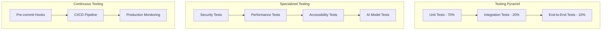

# Testing & Security Documentation 🔒🧪
## LegalSaathi Document Advisor - Comprehensive Quality Assurance

### 🧪 Testing Framework Overview

Our comprehensive testing strategy ensures reliability, security, and performance across all components of the LegalSaathi platform.



---

## 🔬 Testing Strategy

### 1. Unit Testing (70% Coverage Target)

#### Core Components Testing
```python
# Example: Risk Classifier Unit Tests
class TestRiskClassifier:
    """Comprehensive unit tests for risk classification engine"""
    
    def setup_method(self):
        self.classifier = RiskClassifier()
        self.sample_clauses = load_test_clauses()
    
    def test_high_risk_detection(self):
        """Test detection of high-risk clauses"""
        high_risk_clause = "Landlord may increase rent by any amount with 24 hours notice"
        result = self.classifier.classify_clause(high_risk_clause, DocumentType.RENTAL_AGREEMENT)
        
        assert result.level == RiskLevel.RED
        assert result.confidence_percentage > 80
        assert "rent increase" in result.reasons[0].lower()
    
    def test_confidence_scoring(self):
        """Test confidence score calculation"""
        clear_clause = "Tenant shall pay rent on the first day of each month"
        ambiguous_clause = "Party shall comply with all applicable regulations"
        
        clear_result = self.classifier.classify_clause(clear_clause, DocumentType.RENTAL_AGREEMENT)
        ambiguous_result = self.classifier.classify_clause(ambiguous_clause, DocumentType.RENTAL_AGREEMENT)
        
        assert clear_result.confidence_percentage > ambiguous_result.confidence_percentage
    
    def test_document_type_adaptation(self):
        """Test classifier adaptation to different document types"""
        clause = "Either party may terminate with 30 days notice"
        
        rental_result = self.classifier.classify_clause(clause, DocumentType.RENTAL_AGREEMENT)
        employment_result = self.classifier.classify_clause(clause, DocumentType.EMPLOYMENT_CONTRACT)
        
        # Same clause may have different risk levels in different contexts
        assert rental_result.level != employment_result.level or rental_result.reasons != employment_result.reasons
```

#### AI Service Testing
```python
class TestGoogleCloudAIServices:
    """Test Google Cloud AI service integrations"""
    
    @pytest.fixture
    def mock_credentials(self):
        """Mock Google Cloud credentials for testing"""
        with patch.dict(os.environ, {
            'GOOGLE_APPLICATION_CREDENTIALS': 'test-credentials.json',
            'GOOGLE_CLOUD_PROJECT_ID': 'test-project'
        }):
            yield
    
    def test_document_ai_fallback(self, mock_credentials):
        """Test Document AI fallback behavior"""
        with patch('google.cloud.documentai.DocumentProcessorServiceClient') as mock_client:
            mock_client.side_effect = Exception("Service unavailable")
            
            service = GoogleDocumentAIService()
            result = service.process_legal_document(b"test document", "application/pdf")
            
            assert result['success'] is False
            assert 'fallback' in result['error'].lower()
    
    def test_natural_language_analysis(self, mock_credentials):
        """Test Natural Language AI analysis"""
        with patch('google.cloud.language_v1.LanguageServiceClient') as mock_client:
            # Mock successful response
            mock_response = Mock()
            mock_response.document_sentiment.score = 0.2
            mock_response.document_sentiment.magnitude = 0.8
            mock_client.return_value.analyze_sentiment.return_value = mock_response
            
            service = GoogleNaturalLanguageService()
            result = service.analyze_legal_document("Test legal document text")
            
            assert result['success'] is True
            assert 'sentiment' in result
            assert result['sentiment']['score'] == 0.2
```

### 2. Integration Testing (20% Coverage)

#### End-to-End Document Processing
```python
class TestDocumentProcessingIntegration:
    """Integration tests for complete document processing pipeline"""
    
    def test_complete_analysis_workflow(self):
        """Test complete document analysis from input to output"""
        # Sample rental agreement
        document_text = """
        RENTAL AGREEMENT
        
        1. RENT: Tenant agrees to pay $2000 per month
        2. SECURITY DEPOSIT: Tenant shall pay 4 months rent as security deposit
        3. RENT INCREASES: Landlord may increase rent by any amount with 24 hours notice
        4. TERMINATION: Landlord may terminate this agreement at any time without cause
        """
        
        # Process through complete pipeline
        with app.test_client() as client:
            response = client.post('/analyze', json={
                'document_text': document_text,
                'document_type': 'rental_agreement'
            })
            
            assert response.status_code == 200
            data = response.get_json()
            
            # Verify analysis structure
            assert data['success'] is True
            assert 'analysis_results' in data
            assert 'overall_risk' in data
            
            # Verify high-risk clauses detected
            high_risk_clauses = [
                result for result in data['analysis_results']
                if result['risk_level']['level'] == 'RED'
            ]
            assert len(high_risk_clauses) >= 2  # Should detect rent increase and termination clauses
    
    def test_ai_clarification_integration(self):
        """Test AI clarification service integration"""
        with app.test_client() as client:
            # First, analyze a document
            analysis_response = client.post('/analyze', json={
                'document_text': 'Tenant shall pay liquidated damages of $500 per day for breach',
                'document_type': 'rental_agreement'
            })
            
            # Then ask for clarification
            clarification_response = client.post('/api/clarify', json={
                'question': 'What are liquidated damages?',
                'context': analysis_response.get_json()
            })
            
            assert clarification_response.status_code == 200
            clarification_data = clarification_response.get_json()
            
            assert clarification_data['success'] is True
            assert 'response' in clarification_data
            assert 'liquidated damages' in clarification_data['response'].lower()
```

#### API Integration Testing
```python
class TestAPIIntegration:
    """Test API endpoint integrations"""
    
    def test_export_functionality(self):
        """Test PDF and Word export integration"""
        with app.test_client() as client:
            # Analyze document first
            analysis_response = client.post('/analyze', json={
                'document_text': 'Sample legal document for export testing',
                'document_type': 'rental_agreement'
            })
            
            analysis_data = analysis_response.get_json()
            document_id = analysis_data['document_id']
            
            # Test PDF export
            pdf_response = client.get(f'/api/export/pdf/{document_id}')
            assert pdf_response.status_code == 200
            assert pdf_response.content_type == 'application/pdf'
            
            # Test Word export
            docx_response = client.get(f'/api/export/docx/{document_id}')
            assert docx_response.status_code == 200
            assert 'application/vnd.openxmlformats' in docx_response.content_type
    
    def test_translation_integration(self):
        """Test translation service integration"""
        with app.test_client() as client:
            response = client.post('/api/translate', json={
                'text': 'This is a rental agreement',
                'target_language': 'hi',  # Hindi
                'source_language': 'en'
            })
            
            assert response.status_code == 200
            data = response.get_json()
            
            assert data['success'] is True
            assert 'translated_text' in data
            assert data['target_language'] == 'hi'
```

### 3. Performance Testing

#### Load Testing
```python
class TestPerformance:
    """Performance and load testing"""
    
    def test_concurrent_analysis_performance(self):
        """Test system performance under concurrent load"""
        import concurrent.futures
        import time
        
        def analyze_document():
            with app.test_client() as client:
                start_time = time.time()
                response = client.post('/analyze', json={
                    'document_text': 'Sample document for performance testing',
                    'document_type': 'rental_agreement'
                })
                end_time = time.time()
                return response.status_code, end_time - start_time
        
        # Simulate 50 concurrent requests
        with concurrent.futures.ThreadPoolExecutor(max_workers=50) as executor:
            futures = [executor.submit(analyze_document) for _ in range(50)]
            results = [future.result() for future in concurrent.futures.as_completed(futures)]
        
        # Verify all requests succeeded
        success_count = sum(1 for status_code, _ in results if status_code == 200)
        assert success_count >= 45  # Allow for some failures under load
        
        # Verify response times are reasonable
        response_times = [duration for _, duration in results]
        avg_response_time = sum(response_times) / len(response_times)
        assert avg_response_time < 30.0  # Average under 30 seconds
    
    def test_caching_performance(self):
        """Test caching system performance"""
        document_text = "Sample document for cache testing"
        
        with app.test_client() as client:
            # First request (cache miss)
            start_time = time.time()
            response1 = client.post('/analyze', json={
                'document_text': document_text,
                'document_type': 'rental_agreement'
            })
            first_request_time = time.time() - start_time
            
            # Second request (cache hit)
            start_time = time.time()
            response2 = client.post('/analyze', json={
                'document_text': document_text,
                'document_type': 'rental_agreement'
            })
            second_request_time = time.time() - start_time
            
            # Cache hit should be significantly faster
            assert second_request_time < first_request_time * 0.1  # 90% faster
            assert response1.get_json() == response2.get_json()  # Same results
```

### 4. Security Testing

#### Input Validation Testing
```python
class TestSecurity:
    """Security and vulnerability testing"""
    
    def test_xss_prevention(self):
        """Test XSS attack prevention"""
        malicious_inputs = [
            '<script>alert("XSS")</script>',
            '"><script>alert("XSS")</script>',
            'javascript:alert("XSS")',
            '',
            '{{7*7}}',  # Template injection
            '${7*7}',   # Expression injection
        ]
        
        with app.test_client() as client:
            for malicious_input in malicious_inputs:
                response = client.post('/analyze', json={
                    'document_text': malicious_input,
                    'document_type': 'rental_agreement'
                })
                
                # Should either reject input or sanitize it
                if response.status_code == 200:
                    data = response.get_json()
                    # Verify no script execution in response
                    response_text = str(data)
                    assert '<script>' not in response_text
                    assert 'javascript:' not in response_text
                    assert 'onerror=' not in response_text
    
    def test_sql_injection_prevention(self):
        """Test SQL injection prevention"""
        sql_injection_attempts = [
            "'; DROP TABLE users; --",
            "' OR '1'='1",
            "' UNION SELECT * FROM users --",
            "admin'--",
            "admin'/*",
        ]
        
        with app.test_client() as client:
            for injection_attempt in sql_injection_attempts:
                response = client.post('/analyze', json={
                    'document_text': injection_attempt,
                    'document_type': 'rental_agreement'
                })
                
                # Should handle gracefully without database errors
                assert response.status_code in [200, 400]  # Success or bad request, not 500
    
    def test_rate_limiting(self):
        """Test rate limiting functionality"""
        with app.test_client() as client:
            # Make requests up to the limit
            for i in range(10):  # Assuming 10 requests per minute limit
                response = client.post('/analyze', json={
                    'document_text': f'Test document {i}',
                    'document_type': 'rental_agreement'
                })
                assert response.status_code == 200
            
            # Next request should be rate limited
            response = client.post('/analyze', json={
                'document_text': 'Rate limit test',
                'document_type': 'rental_agreement'
            })
            assert response.status_code == 429  # Too Many Requests
    
    def test_data_privacy(self):
        """Test data privacy and cleanup"""
        document_text = "Sensitive legal document content"
        
        with app.test_client() as client:
            response = client.post('/analyze', json={
                'document_text': document_text,
                'document_type': 'rental_agreement'
            })
            
            document_id = response.get_json()['document_id']
            
            # Verify document can be deleted
            delete_response = client.delete(f'/api/analysis/{document_id}')
            assert delete_response.status_code == 200
            
            # Verify document is no longer accessible
            get_response = client.get(f'/api/analysis/{document_id}')
            assert get_response.status_code == 404
```

---

## 🔒 Security Framework

### 1. Authentication & Authorization

#### Multi-Factor Authentication (Future)
```python
class AuthenticationManager:
    """Secure authentication system"""
    
    def __init__(self):
        self.session_timeout = 1800  # 30 minutes
        self.max_login_attempts = 5
        self.lockout_duration = 900  # 15 minutes
    
    def authenticate_user(self, username, password, mfa_token=None):
        """Secure user authentication with MFA support"""
        # Check for account lockout
        if self.is_account_locked(username):
            raise AccountLockedException("Account temporarily locked")
        
        # Verify credentials
        if not self.verify_credentials(username, password):
            self.record_failed_attempt(username)
            raise AuthenticationException("Invalid credentials")
        
        # Verify MFA if enabled
        if self.is_mfa_enabled(username) and not self.verify_mfa(username, mfa_token):
            raise MFAException("Invalid MFA token")
        
        # Create secure session
        session_token = self.create_session(username)
        self.clear_failed_attempts(username)
        
        return session_token
    
    def verify_session(self, session_token):
        """Verify and refresh session token"""
        session = self.get_session(session_token)
        
        if not session or self.is_session_expired(session):
            raise SessionExpiredException("Session expired")
        
        # Refresh session
        self.refresh_session(session)
        return session.user_id
```

#### Role-Based Access Control
```python
class AuthorizationManager:
    """Role-based access control system"""
    
    ROLES = {
        'user': ['analyze_document', 'export_report', 'ask_clarification'],
        'professional': ['bulk_analyze', 'api_access', 'custom_profiles'],
        'admin': ['user_management', 'system_monitoring', 'configuration']
    }
    
    def check_permission(self, user_role, action):
        """Check if user role has permission for action"""
        allowed_actions = self.ROLES.get(user_role, [])
        return action in allowed_actions
    
    def require_permission(self, action):
        """Decorator to require specific permission"""
        def decorator(func):
            @wraps(func)
            def wrapper(*args, **kwargs):
                user_role = self.get_current_user_role()
                if not self.check_permission(user_role, action):
                    raise PermissionDeniedException(f"Action '{action}' not allowed")
                return func(*args, **kwargs)
            return wrapper
        return decorator
```

### 2. Data Protection

#### Encryption Implementation
```python
class EncryptionManager:
    """Data encryption and protection"""
    
    def __init__(self):
        self.encryption_key = self.load_encryption_key()
        self.cipher_suite = Fernet(self.encryption_key)
    
    def encrypt_sensitive_data(self, data):
        """Encrypt sensitive data before storage"""
        if isinstance(data, str):
            data = data.encode('utf-8')
        return self.cipher_suite.encrypt(data)
    
    def decrypt_sensitive_data(self, encrypted_data):
        """Decrypt sensitive data after retrieval"""
        decrypted_bytes = self.cipher_suite.decrypt(encrypted_data)
        return decrypted_bytes.decode('utf-8')
    
    def hash_document_content(self, content):
        """Create secure hash of document content for caching"""
        return hashlib.sha256(content.encode('utf-8')).hexdigest()
```

#### Privacy-by-Design Implementation
```python
class PrivacyManager:
    """Privacy-by-design data handling"""
    
    def __init__(self):
        self.data_retention_policy = {
            'analysis_results': timedelta(hours=1),
            'conversation_history': timedelta(hours=1),
            'cached_documents': timedelta(hours=1),
            'audit_logs': timedelta(days=90)
        }
    
    def process_document_privately(self, document_content):
        """Process document with privacy protection"""
        # Generate anonymous document ID
        document_id = self.generate_anonymous_id()
        
        # Process in memory only
        analysis_result = self.analyze_document_in_memory(document_content)
        
        # Store only anonymized metadata
        metadata = self.create_anonymous_metadata(analysis_result)
        self.store_temporary_metadata(document_id, metadata)
        
        # Schedule automatic cleanup
        self.schedule_cleanup(document_id, self.data_retention_policy['analysis_results'])
        
        return document_id, analysis_result
    
    def anonymize_metadata(self, metadata):
        """Remove personally identifiable information"""
        return {
            'document_type': metadata.get('document_type'),
            'risk_level': metadata.get('overall_risk_level'),
            'analysis_timestamp': metadata.get('timestamp'),
            'confidence_score': metadata.get('confidence_score')
            # Exclude: IP address, user agent, document content, etc.
        }
```

### 3. Secure Communication

#### TLS/SSL Configuration
```python
class SecureCommunication:
    """Secure communication protocols"""
    
    SSL_CONFIG = {
        'ssl_context': 'adhoc',  # Use proper certificates in production
        'ssl_version': ssl.PROTOCOL_TLSv1_2,
        'ciphers': 'ECDHE+AESGCM:ECDHE+CHACHA20:DHE+AESGCM:DHE+CHACHA20:!aNULL:!MD5:!DSS',
        'options': ssl.OP_NO_SSLv2 | ssl.OP_NO_SSLv3 | ssl.OP_NO_TLSv1 | ssl.OP_NO_TLSv1_1
    }
    
    def configure_secure_headers(self, app):
        """Configure security headers"""
        @app.after_request
        def add_security_headers(response):
            response.headers['Strict-Transport-Security'] = 'max-age=31536000; includeSubDomains'
            response.headers['X-Content-Type-Options'] = 'nosniff'
            response.headers['X-Frame-Options'] = 'DENY'
            response.headers['X-XSS-Protection'] = '1; mode=block'
            response.headers['Content-Security-Policy'] = "default-src 'self'; script-src 'self' 'unsafe-inline'"
            return response
```

### 4. Audit & Monitoring

#### Security Event Logging
```python
class SecurityAuditLogger:
    """Comprehensive security audit logging"""
    
    def __init__(self):
        self.logger = logging.getLogger('security_audit')
        self.logger.setLevel(logging.INFO)
        
        # Secure log handler with rotation
        handler = RotatingFileHandler(
            'security_audit.log',
            maxBytes=10*1024*1024,  # 10MB
            backupCount=10
        )
        formatter = logging.Formatter(
            '%(asctime)s - %(levelname)s - %(message)s'
        )
        handler.setFormatter(formatter)
        self.logger.addHandler(handler)
    
    def log_authentication_event(self, username, event_type, ip_address, success=True):
        """Log authentication events"""
        self.logger.info(f"AUTH_{event_type}: user={username}, ip={ip_address}, success={success}")
    
    def log_document_access(self, user_id, document_id, action, ip_address):
        """Log document access events"""
        self.logger.info(f"DOC_ACCESS: user={user_id}, doc={document_id}, action={action}, ip={ip_address}")
    
    def log_security_violation(self, violation_type, details, ip_address):
        """Log security violations"""
        self.logger.warning(f"SECURITY_VIOLATION: type={violation_type}, details={details}, ip={ip_address}")
```

---

## 🚨 Incident Response

### Security Incident Response Plan

#### 1. Detection & Analysis
```python
class SecurityIncidentDetector:
    """Automated security incident detection"""
    
    def __init__(self):
        self.alert_thresholds = {
            'failed_logins': 10,  # per minute
            'rate_limit_violations': 50,  # per minute
            'suspicious_patterns': 5,  # per hour
            'error_rate_spike': 0.1  # 10% error rate
        }
    
    def monitor_security_events(self):
        """Continuous security monitoring"""
        while True:
            current_metrics = self.collect_security_metrics()
            
            for metric, threshold in self.alert_thresholds.items():
                if current_metrics[metric] > threshold:
                    self.trigger_security_alert(metric, current_metrics[metric])
            
            time.sleep(60)  # Check every minute
    
    def trigger_security_alert(self, metric, value):
        """Trigger security incident response"""
        incident = SecurityIncident(
            type=metric,
            severity=self.calculate_severity(metric, value),
            timestamp=datetime.utcnow(),
            details={'metric': metric, 'value': value}
        )
        
        self.incident_response_system.handle_incident(incident)
```

#### 2. Containment & Recovery
```python
class IncidentResponseSystem:
    """Automated incident response and recovery"""
    
    def handle_incident(self, incident):
        """Handle security incident based on severity"""
        if incident.severity == 'CRITICAL':
            self.emergency_response(incident)
        elif incident.severity == 'HIGH':
            self.high_priority_response(incident)
        else:
            self.standard_response(incident)
    
    def emergency_response(self, incident):
        """Emergency response for critical incidents"""
        # 1. Immediate containment
        self.enable_emergency_mode()
        
        # 2. Alert security team
        self.send_emergency_alert(incident)
        
        # 3. Preserve evidence
        self.preserve_incident_evidence(incident)
        
        # 4. Begin recovery procedures
        self.initiate_recovery_procedures(incident)
    
    def enable_emergency_mode(self):
        """Enable emergency security mode"""
        # Temporarily disable non-essential services
        # Increase logging verbosity
        # Enable additional security measures
        pass
```

---

## 📊 Quality Metrics & Monitoring

### Continuous Quality Monitoring

#### Test Coverage Metrics
```python
class QualityMetrics:
    """Track and monitor quality metrics"""
    
    def __init__(self):
        self.metrics = {
            'test_coverage': 0.0,
            'code_quality_score': 0.0,
            'security_score': 0.0,
            'performance_score': 0.0,
            'accessibility_score': 0.0
        }
    
    def calculate_test_coverage(self):
        """Calculate comprehensive test coverage"""
        coverage_data = self.run_coverage_analysis()
        
        return {
            'line_coverage': coverage_data['line_coverage'],
            'branch_coverage': coverage_data['branch_coverage'],
            'function_coverage': coverage_data['function_coverage'],
            'overall_coverage': (
                coverage_data['line_coverage'] * 0.4 +
                coverage_data['branch_coverage'] * 0.4 +
                coverage_data['function_coverage'] * 0.2
            )
        }
    
    def generate_quality_report(self):
        """Generate comprehensive quality report"""
        return {
            'timestamp': datetime.utcnow().isoformat(),
            'test_results': self.get_latest_test_results(),
            'coverage_metrics': self.calculate_test_coverage(),
            'security_scan': self.run_security_scan(),
            'performance_benchmarks': self.run_performance_tests(),
            'code_quality': self.analyze_code_quality(),
            'recommendations': self.generate_recommendations()
        }
```

### Automated Quality Gates

#### CI/CD Quality Checks
```yaml
# GitHub Actions Quality Pipeline
name: Quality Assurance Pipeline

on: [push, pull_request]

jobs:
  quality-checks:
    runs-on: ubuntu-latest
    
    steps:
    - uses: actions/checkout@v2
    
    - name: Set up Python
      uses: actions/setup-python@v2
      with:
        python-version: 3.9
    
    - name: Install dependencies
      run: |
        pip install -r requirements.txt
        pip install pytest pytest-cov black flake8 bandit safety
    
    - name: Code formatting check
      run: black --check .
    
    - name: Linting
      run: flake8 .
    
    - name: Security scan
      run: |
        bandit -r .
        safety check
    
    - name: Unit tests with coverage
      run: pytest --cov=. --cov-report=xml --cov-fail-under=95
    
    - name: Integration tests
      run: pytest tests/integration/ -v
    
    - name: Performance tests
      run: pytest tests/performance/ -v
    
    - name: Security tests
      run: pytest tests/security/ -v
    
    - name: Upload coverage to Codecov
      uses: codecov/codecov-action@v1
```

---

## 🎯 Testing Best Practices

### 1. Test-Driven Development (TDD)

#### Red-Green-Refactor Cycle
```python
# Example TDD workflow for new feature
class TestNewFeature:
    """TDD example for document comparison feature"""
    
    def test_document_comparison_basic(self):
        """RED: Write failing test first"""
        doc1 = "Original contract terms"
        doc2 = "Modified contract terms"
        
        comparator = DocumentComparator()
        result = comparator.compare_documents(doc1, doc2)
        
        # This will fail initially (RED)
        assert result['differences_found'] is True
        assert 'changes' in result
        assert len(result['changes']) > 0
    
    # GREEN: Implement minimal code to pass test
    # REFACTOR: Improve code quality while keeping tests green
```

### 2. Behavior-Driven Development (BDD)

#### Gherkin-Style Test Scenarios
```python
# Example BDD test using pytest-bdd
@scenario('features/document_analysis.feature', 'Analyze rental agreement')
def test_analyze_rental_agreement():
    pass

@given('I have a rental agreement with unfair terms')
def rental_agreement_with_unfair_terms():
    return """
    RENTAL AGREEMENT
    Rent: $2000/month
    Security Deposit: 6 months rent
    Rent increases: Landlord may increase rent by any amount at any time
    """

@when('I submit the document for analysis')
def submit_document(rental_agreement_with_unfair_terms):
    with app.test_client() as client:
        response = client.post('/analyze', json={
            'document_text': rental_agreement_with_unfair_terms,
            'document_type': 'rental_agreement'
        })
        return response

@then('I should see high-risk warnings for unfair clauses')
def verify_high_risk_warnings(submit_document):
    data = submit_document.get_json()
    high_risk_clauses = [
        result for result in data['analysis_results']
        if result['risk_level']['level'] == 'RED'
    ]
    assert len(high_risk_clauses) >= 2
```

### 3. Property-Based Testing

#### Hypothesis-Driven Testing
```python
from hypothesis import given, strategies as st

class TestPropertyBased:
    """Property-based testing for robust validation"""
    
    @given(st.text(min_size=100, max_size=10000))
    def test_document_analysis_never_crashes(self, document_text):
        """Property: Analysis should never crash regardless of input"""
        try:
            with app.test_client() as client:
                response = client.post('/analyze', json={
                    'document_text': document_text,
                    'document_type': 'rental_agreement'
                })
                # Should always return a valid response
                assert response.status_code in [200, 400]  # Success or validation error
        except Exception as e:
            pytest.fail(f"Analysis crashed with input: {document_text[:100]}... Error: {e}")
    
    @given(st.floats(min_value=0.0, max_value=1.0))
    def test_confidence_score_properties(self, confidence_input):
        """Property: Confidence scores should always be between 0 and 1"""
        risk_assessment = RiskAssessment(confidence=confidence_input)
        assert 0.0 <= risk_assessment.confidence <= 1.0
```

---

This comprehensive testing and security framework ensures that LegalSaathi maintains the highest standards of quality, security, and reliability while providing users with confidence in the platform's analysis and recommendations.