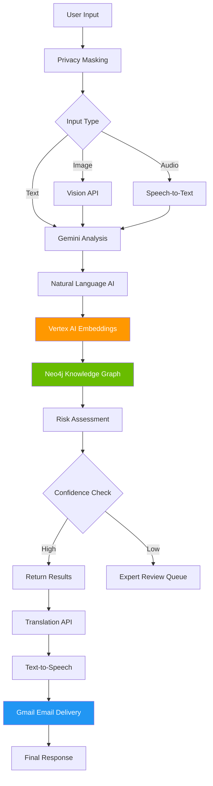

# LegalSaathi API Documentation

## Overview

The LegalSaathi API provides comprehensive legal document analysis, translation, and speech processing capabilities through a RESTful interface built with FastAPI. The platform empowers everyone to understand legal documents through AI-powered analysis, multi-language support, and accessibility features.

**Base URL**: `https://legalsaathi-document-advisor.onrender.com`
**API Version**: 2.0.0
**Live Demo**: [https://legalsaathi-document-advisor.onrender.com](https://legalsaathi-document-advisor.onrender.com)

## Authentication

The API supports both anonymous and authenticated access:
- **Anonymous Users**: Limited rate limits, basic features
- **Firebase Authentication**: Enhanced rate limits, personalized features, expert review access
- **Google Cloud Services**: Internal API key authentication for AI services

## Rate Limiting

### Anonymous Users
- Document Analysis: 5 requests/minute
- File Upload: 3 requests/minute
- Translation: 10 requests/minute
- Speech Services: 5 requests/minute
- AI Clarification: 10 requests/minute

### Authenticated Users (Firebase)
- Document Analysis: 15 requests/minute
- File Upload: 10 requests/minute
- Translation: 30 requests/minute
- Speech Services: 20 requests/minute
- AI Clarification: 25 requests/minute
- Expert Review: 5 requests/day (when confidence < 60%)

## API Endpoints

### Root API Endpoint

#### GET /api
Get API information and version details.

**Response:**
```json
{
  "name": "Legal Saathi Document Advisor API",
  "version": "2.0.0",
  "description": "AI-powered legal document analysis platform",
  "docs_url": "/docs",
  "redoc_url": "/redoc",
  "health_check": "/health",
  "timestamp": "2024-01-01T00:00:00Z"
}
```

### Health Check Endpoints

#### GET /health
Basic health check endpoint.

**Response Model:** `HealthCheckResponse`

**Response:**
```json
{
  "status": "healthy",
  "timestamp": "2024-01-01T00:00:00Z",
  "version": "2.0.0"
}
```

#### GET /api/health/detailed
Detailed health check with service information.

**Response:**
```json
{
  "status": "healthy",
  "services": {
    "groq_api": "connected",
    "document_ai": "connected", 
    "translation": "connected",
    "speech": "connected",
    "natural_language": "connected"
  },
  "system_info": {
    "memory_usage": "45%",
    "cpu_usage": "12%"
  }
}
```

#### GET /api/health/metrics
Get service performance metrics.

**Response:**
```json
{
  "metrics": {
    "requests_per_minute": 25,
    "average_response_time": 1.2,
    "error_rate": 0.02
  }
}
```

### Document Analysis Endpoints

#### POST /api/analyze
Analyze legal document text with privacy-first processing.

**Rate Limit:** 5/15 requests/minute (anonymous/authenticated)
**Response Model:** `DocumentAnalysisResponse`

**Request Body:**
```json
{
  "document_text": "string",
  "document_type": "rental_agreement|employment_contract|nda|loan_agreement|partnership_agreement|general_contract",
  "user_expertise_level": "beginner|intermediate|expert"
}
```

**Privacy Features:**
- Automatic PII masking before cloud processing
- Data unmasking for user display
- No sensitive data stored in cloud services

**Response:**
```json
{
  "analysis_id": "string",
  "overall_risk": {
    "level": "RED|YELLOW|GREEN",
    "score": 0.85,
    "severity": "high|moderate|low",
    "confidence_percentage": 85,
    "reasons": ["string"],
    "risk_categories": {
      "financial": 0.8,
      "legal": 0.7,
      "operational": 0.6
    },
    "low_confidence_warning": false
  },
  "overall_confidence": 0.82,
  "should_route_to_expert": false,
  "confidence_breakdown": {
    "overall_confidence": 0.82,
    "clause_confidences": {"clause_1": 0.85, "clause_2": 0.79},
    "factors_affecting_confidence": ["Complex legal terminology"],
    "improvement_suggestions": ["Consider expert review for high-stakes decisions"]
  },
  "clause_assessments": [
    {
      "clause_id": "1",
      "clause_text": "Full clause text from document",
      "risk_assessment": {
        "level": "RED|YELLOW|GREEN",
        "score": 0.8,
        "severity": "high|moderate|low",
        "confidence_percentage": 85,
        "reasons": ["specific reasons"],
        "risk_categories": {
          "financial": 0.8,
          "legal": 0.7,
          "operational": 0.6
        },
        "low_confidence_warning": false
      },
      "plain_explanation": "Plain language explanation",
      "legal_implications": ["implication1", "implication2"],
      "recommendations": ["recommendation1", "recommendation2"],
      "translation_available": true
    }
  ],
  "summary": "Document analysis summary",
  "processing_time": 2.5,
  "recommendations": ["overall recommendation"],
  "timestamp": "2024-01-01T00:00:00Z",
  "enhanced_insights": {
    "natural_language": {
      "sentiment": "neutral",
      "entities": [],
      "legal_insights": {}
    }
  }
}
```

#### POST /api/analyze/file
Analyze uploaded document file.

**Rate Limit:** 5 requests/minute
**Response Model:** `DocumentAnalysisResponse`

**Request (multipart/form-data):**
- `file`: Document file (PDF, DOC, DOCX, TXT, max 10MB)
- `document_type`: Document type (rental_agreement|employment_contract|nda|loan_agreement|partnership_agreement|general_contract)
- `user_expertise_level`: User expertise level (beginner|intermediate|expert, default: beginner)

**Response:** Same structure as `/api/analyze`

**File Type Support:**
- PDF: `application/pdf`
- DOC: `application/msword`
- DOCX: `application/vnd.openxmlformats-officedocument.wordprocessingml.document`
- TXT: `text/plain`

#### POST /api/analyze/async
Start asynchronous document analysis.

**Rate Limit:** 5 requests/minute

**Request Body:** Same as `/api/analyze`

**Response:**
```json
{
  "success": true,
  "job_id": "string",
  "message": "Analysis started successfully",
  "status_endpoint": "/api/analysis/status/{job_id}"
}
```

#### GET /api/analysis/status/{analysis_id}
Get status of ongoing analysis.

**Response Model:** `AnalysisStatusResponse`

**Response:**
```json
{
  "analysis_id": "string",
  "status": "processing|completed|failed",
  "progress": 75,
  "estimated_completion": "2024-01-01T00:05:00Z",
  "result": null,
  "error_message": null
}
```

#### POST /api/analysis/{analysis_id}/export
Export analysis results.

**Query Parameters:**
- `format`: Export format (pdf|word, default: pdf)

**Response:**
```json
{
  "success": true,
  "message": "Export to pdf format initiated",
  "download_url": "/api/analysis/{analysis_id}/download/pdf"
}
```

### Translation Endpoints

#### POST /api/translate
Translate text to target language.

**Rate Limit:** 20 requests/minute
**Response Model:** `TranslationResponse`

**Request Body:**
```json
{
  "text": "string (1-5000 chars)",
  "target_language": "en|hi|es|fr|de|it|pt|ru|ja|ko|zh|ar|nl|sv|da|no|fi|pl|cs|hu|ro|bg|hr|sk|sl|et|lv|lt|mt|ga|cy|eu|ca|gl|is|mk|sq|sr|bs|me|tr|he|fa|ur|bn|ta|te|ml|kn|gu|pa|or|as|mr|ne|si|my|km|lo|th|vi|id|ms|tl|sw|am|yo|ig|ha|zu|af|xh",
  "source_language": "auto|{any supported language code}"
}
```

**Response:**
```json
{
  "success": true,
  "translated_text": "string",
  "source_language": "en",
  "target_language": "es", 
  "language_name": "Spanish (Español)",
  "confidence_score": 0.9,
  "error_message": null,
  "timestamp": "2024-01-01T00:00:00Z"
}
```

#### POST /api/translate/clause
Translate legal clause with context.

**Rate Limit:** 15 requests/minute
**Response Model:** `ClauseTranslationResponse`

**Request Body:**
```json
{
  "clause_id": "string",
  "clause_text": "string (1-2000 chars)",
  "target_language": "es",
  "source_language": "auto",
  "include_legal_context": true
}
```

**Response:**
```json
{
  "success": true,
  "clause_id": "string",
  "original_text": "string",
  "translated_text": "string",
  "source_language": "en",
  "target_language": "es",
  "language_name": "Spanish (Español)",
  "legal_context": "This clause has been translated with legal terminology preserved for accuracy in Spanish (Español).",
  "confidence_score": 0.9,
  "error_message": null,
  "timestamp": "2024-01-01T00:00:00Z"
}
```

#### GET /api/translate/languages
Get supported languages for translation.

**Response Model:** `SupportedLanguagesResponse`

**Response:**
```json
{
  "success": true,
  "languages": [
    {
      "code": "en",
      "name": "English"
    },
    {
      "code": "hi", 
      "name": "Hindi (हिंदी)"
    }
  ],
  "total_count": 70,
  "timestamp": "2024-01-01T00:00:00Z"
}
```

### Speech Processing Endpoints

#### POST /api/speech/speech-to-text
Convert speech to text.

**Rate Limit:** 10 requests/minute
**Response Model:** `SpeechToTextResponse`

**Request (multipart/form-data):**
- `audio_file`: Audio file (WEBM, WAV, MP3, FLAC, max 10MB)
- `language_code`: Language code (default: "en-US")
- `enable_punctuation`: Enable automatic punctuation (default: true)

**Supported Language Codes:**
- en-US, en-GB, hi-IN, es-ES, es-US, fr-FR, de-DE, it-IT, pt-BR, ru-RU, ja-JP, ko-KR, zh-CN

**Response:**
```json
{
  "success": true,
  "transcript": "string",
  "confidence": 0.95,
  "language_detected": "en-US",
  "processing_time": 1.2,
  "error_message": null,
  "timestamp": "2024-01-01T00:00:00Z"
}
```

#### POST /api/speech/text-to-speech
Convert text to speech.

**Rate Limit:** 10 requests/minute

**Request Body:**
```json
{
  "text": "string (1-5000 chars)",
  "language_code": "en-US",
  "voice_gender": "NEUTRAL|MALE|FEMALE",
  "speaking_rate": 0.9,
  "pitch": 0.0,
  "audio_encoding": "MP3|WAV|OGG_OPUS"
}
```

**Response:** Audio file (binary data) with headers:
- Content-Type: audio/mpeg (or audio/wav, audio/ogg)
- Content-Disposition: attachment; filename=speech.mp3
- Content-Length: {size}

#### POST /api/speech/text-to-speech/info
Get text-to-speech metadata without audio.

**Rate Limit:** 15 requests/minute
**Response Model:** `TextToSpeechResponse`

**Request Body:** Same as `/api/speech/text-to-speech`

**Response:**
```json
{
  "success": true,
  "audio_content_type": "audio/mp3",
  "audio_size_bytes": 15360,
  "language_code": "en-US",
  "voice_gender": "NEUTRAL",
  "processing_time": 0.8,
  "error_message": null,
  "timestamp": "2024-01-01T00:00:00Z"
}
```

#### GET /api/speech/languages
Get supported languages for speech services.

**Response Model:** `SupportedLanguagesResponse`

**Response:**
```json
{
  "success": true,
  "speech_to_text_languages": [
    {
      "code": "en-US",
      "name": "English (US)"
    },
    {
      "code": "hi-IN", 
      "name": "Hindi (India)"
    }
  ],
  "text_to_speech_languages": [
    {
      "code": "en-US",
      "name": "English (US)"
    }
  ],
  "total_stt_count": 13,
  "total_tts_count": 13,
  "timestamp": "2024-01-01T00:00:00Z"
}
```

### AI Clarification Endpoints

#### POST /api/ai/clarify
Get AI-powered clarification.

**Rate Limit:** 15 requests/minute
**Response Model:** `ClarificationResponse`

**Request Body:**
```json
{
  "question": "string (5-1000 chars)",
  "context": {
    "document": {
      "documentType": "rental_agreement",
      "overallRisk": "RED",
      "summary": "Document summary",
      "totalClauses": 5
    },
    "clause": {
      "clauseId": "1",
      "text": "Clause text",
      "riskLevel": "RED",
      "explanation": "Plain explanation",
      "implications": ["implication1"],
      "recommendations": ["recommendation1"]
    },
    "conversationHistory": []
  },
  "user_expertise_level": "beginner|intermediate|expert",
  "conversation_id": "optional_string"
}
```

**Response:**
```json
{
  "success": true,
  "response": "AI clarification response",
  "conversation_id": "string",
  "confidence_score": 85,
  "response_quality": "high|medium|basic",
  "processing_time": 1.2,
  "fallback": false,
  "service_used": "groq|keyword_fallback|emergency_fallback",
  "error_type": null
}
```

#### GET /api/ai/conversation/summary
Get conversation summary and analytics.

**Response Model:** `ConversationSummaryResponse`

**Response:**
```json
{
  "success": true,
  "total_questions": 15,
  "recent_questions": [
    {
      "question": "What does this clause mean?",
      "timestamp": "2024-01-01T00:00:00Z",
      "confidence": "high"
    }
  ],
  "analytics": {
    "avg_response_length": 150,
    "fallback_rate": 0.1,
    "high_confidence_rate": 0.8
  }
}
```

#### DELETE /api/ai/conversation/clear
Clear conversation history.

**Response:**
```json
{
  "success": true,
  "message": "Conversation history cleared successfully"
}
```

### Authentication Endpoints

#### POST /api/auth/verify-token
Verify Firebase ID token for authenticated access.

**Request Body:**
```json
{
  "token": "firebase_id_token_string"
}
```

**Response:**
```json
{
  "success": true,
  "user": {
    "uid": "user_id",
    "email": "user@example.com",
    "display_name": "User Name"
  }
}
```

#### POST /api/auth/register
Register a new user account.

**Request Body:**
```json
{
  "email": "user@example.com",
  "password": "secure_password",
  "display_name": "User Name"
}
```

### Expert Review Endpoints (Human-in-the-Loop)

#### POST /api/expert-queue/submit
Submit document for expert review when AI confidence is low.

**Authentication Required:** Yes
**Rate Limit:** 5 requests/day

**Request Body:**
```json
{
  "document_content": "base64_encoded_document",
  "ai_analysis": "DocumentAnalysisResponse_object",
  "user_email": "user@example.com",
  "confidence_score": 0.45,
  "confidence_breakdown": "ConfidenceBreakdown_object"
}
```

#### GET /api/expert-queue/status/{review_id}
Check status of expert review request.

**Response:**
```json
{
  "review_id": "string",
  "status": "PENDING|IN_REVIEW|COMPLETED|CANCELLED",
  "estimated_completion": "2024-01-01T12:00:00Z",
  "expert_assigned": true,
  "progress": 75
}
```

### Vision API Endpoints

The Vision API endpoints provide image text extraction and document analysis capabilities using Google Cloud Vision API with intelligent fallback mechanisms.

#### POST /api/vision/extract-text
Extract text from uploaded image using Vision API.

**Rate Limit:** 10 requests/minute

**Request (multipart/form-data):**
- `file`: Image file (JPEG, PNG, WEBP, BMP, GIF, max 20MB)
- `preprocess`: Enable image preprocessing for legal documents (default: true)

**Supported Image Formats:**
- JPEG/JPG (recommended for photos)
- PNG (recommended for screenshots)
- WEBP, BMP, GIF (also supported)
- Maximum file size: 20MB
- Maximum resolution: 4096x4096 pixels
- Minimum resolution: 100x100 pixels

**Response:**
```json
{
  "success": true,
  "filename": "contract.jpg",
  "extracted_text": "Full extracted text from image",
  "high_confidence_text": "Text with confidence > 70%",
  "confidence_scores": {
    "average_confidence": 0.85,
    "high_confidence_ratio": 0.78,
    "min_confidence_threshold": 0.7,
    "total_text_blocks": 25,
    "high_confidence_blocks": 20
  },
  "text_blocks_detected": 25,
  "legal_sections_identified": 3,
  "processing_metadata": {
    "api_used": "Google Cloud Vision API",
    "processing_time": 2.1,
    "image_preprocessing_applied": true
  },
  "warnings": [
    "Low average confidence (75%). Text extraction may be inaccurate."
  ]
}
```

**Error Response (Vision API not available):**
```json
{
  "success": false,
  "filename": "contract.jpg",
  "extracted_text": "",
  "error": "Vision API not configured - image text extraction not available",
  "fallback_used": true,
  "image_info": {
    "width": 1200,
    "height": 800,
    "size_bytes": 245760
  }
}
```

#### POST /api/vision/analyze-document
Analyze legal document from image using Vision API + document analysis pipeline.

**Rate Limit:** 5 requests/minute

**Request (multipart/form-data):**
- `file`: Image file (JPEG, PNG, WEBP, BMP, GIF, max 20MB)
- `document_type`: Document type (default: "general_contract")
- `user_expertise_level`: User expertise level (default: "beginner")

**Response:**
```json
{
  "success": true,
  "analysis_id": "uuid-string",
  "filename": "contract.jpg",
  "text_extraction": {
    "method": "Google Cloud Vision API",
    "extracted_text_length": 2450,
    "confidence_scores": {
      "average_confidence": 0.85,
      "high_confidence_ratio": 0.78,
      "min_confidence_threshold": 0.7,
      "total_text_blocks": 25,
      "high_confidence_blocks": 20
    },
    "text_blocks_detected": 25,
    "legal_sections_identified": 3
  },
  "document_analysis": {
    "overall_risk": {
      "level": "YELLOW",
      "score": 0.65,
      "severity": "moderate",
      "confidence_percentage": 82
    },
    "total_clauses": 8,
    "processing_time": 3.2,
    "summary": "Document analysis summary"
  },
  "warnings": [
    "Text extraction confidence is below 80%. Legal analysis may be affected by OCR inaccuracies."
  ]
}
```

#### GET /api/vision/status
Get status of Vision API services.

**Response:**
```json
{
  "dual_vision_service": {
    "enabled": true,
    "fallback_enabled": true
  },
  "document_ai": {
    "enabled": true,
    "project_id": "your-project-id",
    "location": "us-central1",
    "connectivity": "connected"
  },
  "vision_api": {
    "enabled": true,
    "project_id": "your-project-id", 
    "location": "us-central1",
    "connectivity": "connected"
  },
  "vision_api_details": {
    "supported_formats": ["JPEG", "PNG", "WEBP", "BMP", "GIF"],
    "max_file_size_mb": 20,
    "max_resolution": [4096, 4096],
    "min_confidence_threshold": 0.7,
    "rate_limit_per_day": 100,
    "cache_ttl_hours": 1
  }
}
```

#### GET /api/vision/supported-formats
Get list of supported file formats for Vision API.

**Response:**
```json
{
  "success": true,
  "supported_formats": {
    "images": [
      "image/jpeg", "image/jpg", "image/png",
      "image/webp", "image/bmp", "image/gif"
    ],
    "documents": [
      "application/pdf", "application/x-pdf",
      "application/msword",
      "application/vnd.openxmlformats-officedocument.wordprocessingml.document",
      "text/plain"
    ]
  },
  "file_size_limits": {
    "images": "20MB",
    "documents": "20MB"
  },
  "processing_methods": {
    "images": "Google Cloud Vision API",
    "pdfs": "Google Document AI",
    "fallback": "Basic text extraction"
  }
}
```

**Vision API Rate Limits:**
- Text extraction: 100 requests per user per day
- Cost monitoring: $1.50 per user per day
- Response caching: 1 hour TTL
- Automatic fallback when limits exceeded

**Vision API Error Codes:**
- `503`: Vision API service not available
- `429`: Rate limit exceeded (100 requests/day)
- `413`: File size exceeds 20MB limit
- `422`: Unsupported image format or corrupted file
- `400`: Image too small (minimum 100x100 pixels)

### Document Comparison Endpoints

#### POST /api/compare
Compare two legal documents.

**Rate Limit:** 5 requests/minute
**Response Model:** `DocumentComparisonResponse`

**Request Body:**
```json
{
  "document1": {
    "text": "string",
    "title": "string"
  },
  "document2": {
    "text": "string", 
    "title": "string"
  },
  "comparison_type": "full|clauses|terms|structure"
}
```

**Response:**
```json
{
  "comparison_id": "string",
  "differences": [
    {
      "type": "addition|deletion|modification",
      "section": "string",
      "description": "string",
      "impact": "high|medium|low"
    }
  ],
  "similarities": [
    {
      "section": "string",
      "match_percentage": 95.5
    }
  ],
  "recommendation": "string"
}
```

#### GET /api/compare/{comparison_id}/summary
Get summary of a previous comparison.

**Response Model:** `ComparisonSummaryResponse`

**Response:**
```json
{
  "comparison_id": "string",
  "summary": "Comparison summary",
  "key_differences": ["difference1", "difference2"],
  "overall_similarity": 0.85,
  "recommendation": "string"
}
```

### Export Endpoints

#### POST /api/export/pdf
Export analysis results to PDF.

**Rate Limit:** 5 requests/minute

**Request Body:**
```json
{
  "analysis": {
    // DocumentAnalysisResponse object
  }
}
```

**Response:** PDF file (binary data) with headers:
- Content-Type: application/pdf
- Content-Disposition: attachment; filename=analysis.pdf

#### POST /api/export/word
Export analysis results to Word document.

**Rate Limit:** 5 requests/minute

**Request Body:**
```json
{
  "analysis": {
    // DocumentAnalysisResponse object
  }
}
```

**Response:** Word file (binary data) with headers:
- Content-Type: application/vnd.openxmlformats-officedocument.wordprocessingml.document
- Content-Disposition: attachment; filename=analysis.docx

### Semantic Search Endpoints (Vertex AI)

#### POST /api/search/similar-documents
Find similar legal documents using semantic search.

**Rate Limit:** 10 requests/minute
**Authentication Required:** Yes

**Request Body:**
```json
{
  "document_text": "string",
  "document_type": "rental_agreement|employment_contract|nda|loan_agreement|partnership_agreement|general_contract",
  "similarity_threshold": 0.8,
  "max_results": 10
}
```

**Response:**
```json
{
  "success": true,
  "similar_documents": [
    {
      "document_id": "string",
      "similarity_score": 0.92,
      "document_type": "employment_contract",
      "key_clauses": ["non_compete", "termination"],
      "risk_level": "YELLOW"
    }
  ],
  "total_results": 5,
  "processing_time": 1.8
}
```

#### POST /api/search/clause-precedents
Search for legal precedents and similar clauses.

**Rate Limit:** 15 requests/minute
**Authentication Required:** Yes

**Request Body:**
```json
{
  "clause_text": "string",
  "legal_domain": "employment|real_estate|business|intellectual_property",
  "jurisdiction": "US|UK|CA|AU|IN"
}
```

**Response:**
```json
{
  "success": true,
  "precedents": [
    {
      "precedent_id": "string",
      "similarity_score": 0.89,
      "case_reference": "Smith v. Johnson (2023)",
      "jurisdiction": "US",
      "outcome": "Clause upheld with modifications",
      "key_insights": ["Enforceability depends on geographic scope"]
    }
  ],
  "legal_analysis": "string",
  "recommendations": ["string"]
}
```

### Email Notification Endpoints

#### POST /api/email/send-analysis-report
Send analysis report via Gmail OAuth2.

**Rate Limit:** 5 requests/hour per user
**Authentication Required:** Yes

**Request Body:**
```json
{
  "recipient_email": "user@example.com",
  "analysis_id": "string",
  "include_pdf": true,
  "custom_message": "Optional custom message"
}
```

**Response:**
```json
{
  "success": true,
  "email_id": "string",
  "delivery_status": "sent",
  "timestamp": "2024-01-01T00:00:00Z"
}
```

#### GET /api/email/delivery-status/{email_id}
Check email delivery status.

**Response:**
```json
{
  "email_id": "string",
  "status": "sent|delivered|failed|bounced",
  "delivered_at": "2024-01-01T00:00:00Z",
  "error_message": null
}
```

### Knowledge Graph Endpoints (Neo4j)

#### GET /api/knowledge-graph/entity-relationships/{entity_id}
Get relationships for a legal entity.

**Rate Limit:** 20 requests/minute
**Authentication Required:** Yes

**Response:**
```json
{
  "entity_id": "string",
  "entity_type": "person|company|contract|clause",
  "relationships": [
    {
      "related_entity_id": "string",
      "relationship_type": "party_to|contains|references",
      "strength": 0.85,
      "context": "Employment contract relationship"
    }
  ],
  "total_relationships": 12
}
```

#### POST /api/knowledge-graph/query
Execute custom Cypher query on legal knowledge graph.

**Rate Limit:** 10 requests/minute
**Authentication Required:** Yes (Admin only)

**Request Body:**
```json
{
  "cypher_query": "MATCH (c:Contract)-[:CONTAINS]->(cl:Clause) WHERE cl.risk_level = 'HIGH' RETURN c, cl LIMIT 10",
  "parameters": {}
}
```

### Background Tasks Endpoints

#### POST /api/tasks/cleanup
Trigger cache cleanup.

**Response:**
```json
{
  "success": true,
  "message": "Cache cleanup scheduled"
}
```

#### POST /api/tasks/rebuild-knowledge-graph
Rebuild Neo4j knowledge graph from recent analyses.

**Authentication Required:** Yes (Admin only)

**Response:**
```json
{
  "success": true,
  "message": "Knowledge graph rebuild initiated",
  "estimated_completion": "2024-01-01T01:00:00Z"
}
```

### Logging Endpoints

#### GET /api/logs
Get recent application logs.

**Query Parameters:**
- `lines`: Number of log lines to return (default: 100)

**Response:**
```json
{
  "logs": ["log line 1", "log line 2"]
}
```

## Error Handling

### Error Response Format

```json
{
  "error": "Error Type",
  "message": "Detailed error message", 
  "error_code": "HTTP_STATUS_CODE",
  "timestamp": "2024-01-01T00:00:00Z"
}
```

### Common Error Codes

- **400 Bad Request**: Invalid request parameters or validation errors
- **401 Unauthorized**: Missing or invalid API key
- **413 Payload Too Large**: File size exceeds 10MB limit
- **422 Unprocessable Entity**: Invalid file type or content
- **429 Too Many Requests**: Rate limit exceeded
- **500 Internal Server Error**: Server-side error
- **503 Service Unavailable**: External AI service unavailable

## Request/Response Examples

### Document Analysis Example

**Request:**
```bash
curl -X POST "https://legalsaathi-document-advisor.onrender.com/api/analyze" \
  -H "Content-Type: application/json" \
  -d '{
    "text": "This agreement shall be governed by the laws of California...",
    "document_type": "contract",
    "user_expertise_level": "beginner"
  }'
```

**Response:**
```json
{
  "analysis_id": "analysis_123",
  "summary": "This is a standard contract with California governing law...",
  "key_points": [
    "Governed by California law",
    "30-day termination clause",
    "Liability limitations apply"
  ],
  "risks": [
    {
      "level": "medium",
      "description": "Broad liability waiver clause",
      "recommendation": "Consider negotiating more specific limitations"
    }
  ],
  "overall_assessment": {
    "fairness_score": 0.75,
    "complexity_score": 0.60,
    "recommendation": "Generally fair contract with some areas for negotiation"
  }
}
```

### Translation Example

**Request:**
```bash
curl -X POST "https://legalsaathi-document-advisor.onrender.com/api/translate" \
  -H "Content-Type: application/json" \
  -d '{
    "text": "This agreement is binding upon both parties",
    "target_language": "es",
    "source_language": "en"
  }'
```

**Response:**
```json
{
  "translated_text": "Este acuerdo es vinculante para ambas partes",
  "source_language": "en",
  "target_language": "es",
  "confidence": 0.96
}
```

## SDK and Integration

### JavaScript/TypeScript Integration

```typescript
class LegalSaathiAPI {
  private baseURL = 'https://legalsaathi-document-advisor.onrender.com';
  
  async analyzeDocument(text: string, documentType: string) {
    const response = await fetch(`${this.baseURL}/api/analyze`, {
      method: 'POST',
      headers: {
        'Content-Type': 'application/json',
      },
      body: JSON.stringify({
        text,
        document_type: documentType,
        user_expertise_level: 'beginner'
      })
    });
    
    return response.json();
  }
  
  async translateText(text: string, targetLanguage: string) {
    const response = await fetch(`${this.baseURL}/api/translate`, {
      method: 'POST',
      headers: {
        'Content-Type': 'application/json',
      },
      body: JSON.stringify({
        text,
        target_language: targetLanguage
      })
    });
    
    return response.json();
  }
}
```

### Python Integration

```python
import requests
import json

class LegalSaathiAPI:
    def __init__(self):
        self.base_url = "https://legalsaathi-document-advisor.onrender.com"
    
    def analyze_document(self, text: str, document_type: str):
        url = f"{self.base_url}/api/analyze"
        payload = {
            "text": text,
            "document_type": document_type,
            "user_expertise_level": "beginner"
        }
        
        response = requests.post(url, json=payload)
        return response.json()
    
    def translate_text(self, text: str, target_language: str):
        url = f"{self.base_url}/api/translate"
        payload = {
            "text": text,
            "target_language": target_language
        }
        
        response = requests.post(url, json=payload)
        return response.json()
```

## Google AI Tools Integration

### Primary AI Services Used

#### 1. Google Gemini API
- **Purpose**: Advanced document analysis and risk assessment
- **Usage**: Primary AI engine for legal document understanding
- **Features**: Context-aware analysis, experience-level adaptation
- **Fallback**: Groq API for high availability

#### 2. Google Cloud Vision API
- **Purpose**: Text extraction from images and scanned documents
- **Usage**: OCR for legal document images (contracts, agreements)
- **Features**: High-confidence text extraction, legal document optimization
- **Fallback**: Basic image processing when API unavailable

#### 3. Google Cloud Translation API
- **Purpose**: Multi-language document translation
- **Usage**: Translate analysis results to 50+ languages
- **Features**: Legal context preservation, cultural adaptation
- **Rate Limit**: 1000 characters per request

#### 4. Google Cloud Speech-to-Text
- **Purpose**: Voice input for document content
- **Usage**: Accessibility feature for document input
- **Features**: Legal terminology recognition, punctuation
- **Supported**: 13+ languages with neural models

#### 5. Google Cloud Text-to-Speech
- **Purpose**: Audio output for analysis results
- **Usage**: Accessibility feature for visually impaired users
- **Features**: Neural voices, adjustable speech parameters
- **Output**: MP3, WAV, OGG formats

#### 6. Google Cloud Natural Language AI
- **Purpose**: Advanced text analysis and entity extraction
- **Usage**: Legal entity recognition, sentiment analysis
- **Features**: Legal-specific entity types, confidence scoring

#### 7. Google Vertex AI
- **Purpose**: Semantic search and document similarity analysis
- **Usage**: Vector embeddings for legal document comparison and RAG
- **Features**: Document similarity scoring, semantic search, precedent matching
- **Rate Limit**: 1000 embedding requests per day

#### 8. Firebase Gmail OAuth2
- **Purpose**: Secure email delivery and user communication
- **Usage**: Professional email delivery for analysis reports and expert notifications
- **Features**: OAuth2-authenticated Gmail API, secure attachments, user consent-based communication

#### 9. Neo4j Graph Database
- **Purpose**: Legal knowledge graph and relationship mapping
- **Usage**: Legal entity relationships, contract dependencies, precedent connections
- **Features**: Graph-based queries, relationship discovery, legal research enhancement

### Enhanced AI Integration Architecture



## Performance Considerations

- **Multi-level Caching**: Analysis (1hr), Translation (24hr), Speech (6hr)
- **Parallel Processing**: Concurrent AI service calls
- **Privacy-First**: PII masking before cloud processing
- **Intelligent Fallbacks**: Multiple AI service redundancy
- **Rate Limiting**: User-based limits with Firebase authentication
- **Async Processing**: Background expert review processing

## Monitoring and Analytics

The API includes built-in monitoring for:
- Response times
- Error rates
- Usage patterns
- Service health
- Resource utilization

Access monitoring data through the `/api/health/metrics` endpoint.