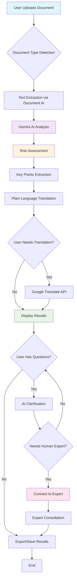
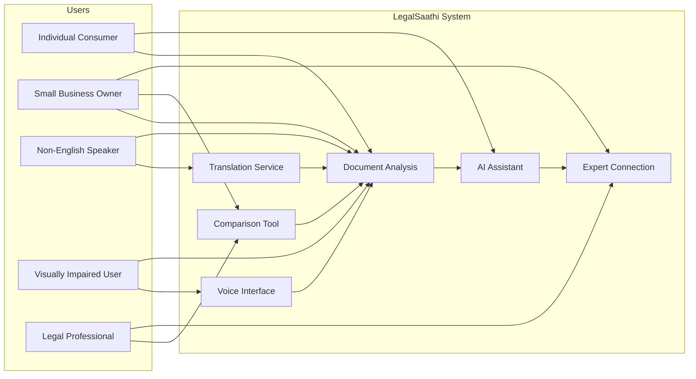
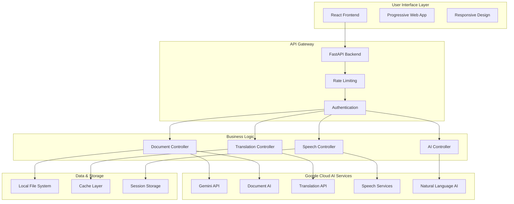
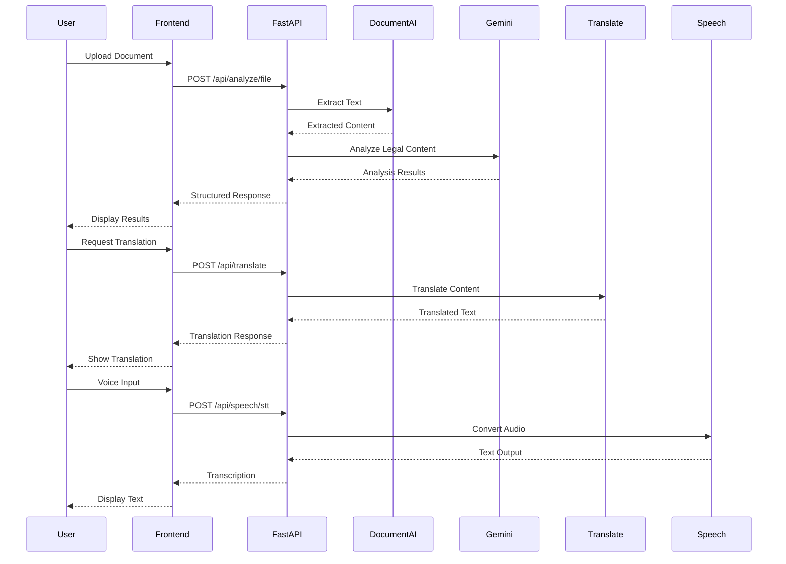

# LegalSaathi: AI-Powered Legal Document Demystification

## Executive Summary

**Problem Statement**: Legal documents are filled with complex jargon that creates information asymmetry, exposing individuals to financial and legal risks.

**Solution**: LegalSaathi is an AI-powered platform that transforms complex legal documents into clear, accessible guidance using Google Cloud's generative AI services.

**Impact**: Empowers everyday citizens and small business owners to make informed decisions and protect themselves from legal and financial risks.

---

## Brief About Our Prototype

### What is LegalSaathi?

LegalSaathi is a comprehensive legal document analysis platform that combines:

- **AI-Powered Analysis**: Uses Google Gemini for intelligent document interpretation
- **Multi-Language Support**: Translates legal documents into 9+ languages
- **Voice Interaction**: Speech-to-text and text-to-speech capabilities
- **Document Comparison**: Side-by-side analysis of contract versions
- **Risk Assessment**: Automated identification of potential legal risks
- **Expert Consultation**: Direct connection to human legal experts

### Key Features

1. **Intelligent Document Analysis**
   - Extracts key clauses and terms
   - Provides plain-language explanations
   - Identifies potential risks and red flags
   - Generates fairness and complexity scores

2. **Multi-Language Translation**
   - Supports 9 major languages
   - Context-aware legal translation
   - Cultural adaptation for different legal systems
   - Preserves legal meaning and intent

3. **Voice Accessibility**
   - Speech-to-text for document input
   - Text-to-speech for audio explanations
   - Multiple voice options and languages
   - Accessibility for visually impaired users

4. **Document Comparison**
   - Side-by-side contract analysis
   - Highlights differences and similarities
   - Impact assessment of changes
   - Version tracking capabilities

5. **AI Clarification Assistant**
   - Interactive Q&A about document terms
   - Context-aware explanations
   - Follow-up question suggestions
   - Conversation history and analytics

---

## How Different from Existing Solutions?

### Current Market Limitations

| Existing Solutions | LegalSaathi Advantage |
|-------------------|----------------------|
| **Generic AI Tools** | Specialized legal document focus |
| **English Only** | Multi-language support with legal context |
| **Text-Based Only** | Voice interaction and accessibility |
| **Single Document** | Document comparison and version analysis |
| **No Expert Access** | Direct connection to human legal experts |
| **Complex Interfaces** | Intuitive, user-friendly design |
| **Limited AI Models** | Google Cloud's advanced AI ecosystem |

### Unique Differentiators

1. **Legal-Specific AI Training**: Specialized prompts and context for legal document analysis
2. **Comprehensive Google Cloud Integration**: Leverages multiple AI services in one platform
3. **Accessibility-First Design**: Voice interaction and multi-language support
4. **Risk-Focused Analysis**: Proactive identification of potential legal issues
5. **Cultural Legal Adaptation**: Translation considers different legal systems
6. **Progressive Web App**: Works across all devices and platforms

---

## Problem-Solution Alignment

### The Problem We Solve

**Information Asymmetry in Legal Documents**

- 📊 **Statistics**: 89% of people don't read terms of service
- 💰 **Financial Impact**: Average person loses $1,200/year due to unfavorable contract terms
- ⚖️ **Legal Risk**: 67% of small businesses face legal issues from contract misunderstandings
- 🌍 **Global Issue**: Language barriers compound the problem internationally

### Our Solution Impact

**Democratizing Legal Understanding**

- ✅ **Accessibility**: Makes legal documents understandable to everyone
- 🛡️ **Protection**: Identifies risks before signing
- 🌐 **Inclusion**: Multi-language support for diverse communities
- 💡 **Education**: Teaches users about legal concepts
- ⚡ **Efficiency**: Reduces time from hours to minutes

---

## Unique Selling Proposition (USP)

### "The Only AI Legal Assistant That Speaks Your Language, Literally and Figuratively"

**Core Value Propositions:**

1. **Comprehensive AI Integration**: First platform to combine Google's entire AI ecosystem for legal analysis
2. **Universal Accessibility**: Voice and multi-language support for global reach
3. **Risk-First Approach**: Proactive protection rather than reactive explanation
4. **Human-AI Hybrid**: AI analysis with human expert backup
5. **Privacy-Focused**: Local processing with secure cloud AI integration

---

## Complete Feature List

### 🔍 Document Analysis Features
- Intelligent text extraction from PDFs, DOCs, images
- Key clause identification and explanation
- Risk assessment with severity levels
- Fairness scoring algorithm
- Complexity analysis and simplification
- Legal term glossary integration

### 🌐 Translation & Localization
- 9+ language support (English, Spanish, French, German, Italian, Portuguese, Hindi, Chinese, Japanese, Korean)
- Legal context preservation
- Cultural legal system adaptation
- Bidirectional translation
- Confidence scoring

### 🎤 Voice & Accessibility
- Speech-to-text document input
- Text-to-speech explanations
- Multiple voice options per language
- Adjustable speaking rate and pitch
- Audio export capabilities
- Screen reader compatibility

### 📊 Comparison & Analysis
- Side-by-side document comparison
- Change tracking and impact analysis
- Version history management
- Similarity scoring
- Difference highlighting
- Recommendation engine

### 🤖 AI Assistant Features
- Interactive Q&A about documents
- Context-aware clarifications
- Follow-up question suggestions
- Conversation analytics
- Learning from user interactions
- Personalized recommendations

### 👨‍💼 Expert Integration
- Direct connection to legal professionals
- Expert verification of AI analysis
- Consultation scheduling
- Case complexity assessment
- Referral system
- Quality assurance

### 🔒 Security & Privacy
- End-to-end encryption
- Local data processing options
- GDPR compliance
- Secure file handling
- Anonymous usage analytics
- Data retention controls

---

## Process Flow Diagram



## Use Case Diagram



## Wireframes/Mock Diagrams

### Main Dashboard
```
┌─────────────────────────────────────────────────────────────┐
│ LegalSaathi 🏛️                                    [Profile] │
├─────────────────────────────────────────────────────────────┤
│                                                             │
│  📄 Upload Document                                         │
│  ┌─────────────────────────────────────────────────────┐   │
│  │ Drag & Drop or Click to Upload                      │   │
│  │ Supported: PDF, DOC, DOCX, TXT, Images            │   │
│  └─────────────────────────────────────────────────────┘   │
│                                                             │
│  🎤 Voice Input    📊 Compare Docs    🌐 Translate         │
│                                                             │
│  Recent Analyses:                                           │
│  • Contract_2024.pdf - High Risk ⚠️                       │
│  • Terms_of_Service.txt - Medium Risk ⚡                   │
│  • Rental_Agreement.pdf - Low Risk ✅                      │
│                                                             │
└─────────────────────────────────────────────────────────────┘
```

### Analysis Results
```
┌─────────────────────────────────────────────────────────────┐
│ Analysis Results: Employment_Contract.pdf                   │
├─────────────────────────────────────────────────────────────┤
│                                                             │
│ 📊 Overall Assessment                                       │
│ Fairness Score: 7.5/10 ⭐⭐⭐⭐⭐⭐⭐⚪⚪⚪                    │
│ Complexity: Medium 📈                                       │
│ Risk Level: Medium ⚠️                                       │
│                                                             │
│ 🔍 Key Points                                              │
│ • 90-day probation period                                   │
│ • Non-compete clause (6 months)                            │
│ • Intellectual property assignment                          │
│                                                             │
│ ⚠️ Identified Risks                                         │
│ • Broad non-compete clause may limit future employment     │
│ • Overtime compensation not clearly defined                 │
│                                                             │
│ 💬 Ask AI Assistant    🌐 Translate    👨‍💼 Contact Expert   │
│                                                             │
└─────────────────────────────────────────────────────────────┘
```

---

## Architecture Diagram

### High-Level System Architecture



### Data Flow Architecture



---

## Technologies Used

### Frontend Technologies
- **React 18**: Modern UI framework with hooks and concurrent features
- **TypeScript**: Type-safe JavaScript for better development experience
- **Vite**: Fast build tool and development server
- **Tailwind CSS**: Utility-first CSS framework for responsive design
- **Progressive Web App**: Offline capabilities and native app experience

### Backend Technologies
- **FastAPI**: Modern Python web framework with automatic API documentation
- **Uvicorn**: ASGI server for production deployment
- **Pydantic**: Data validation and serialization
- **SlowAPI**: Rate limiting and security middleware
- **Python 3.12**: Latest Python runtime with performance improvements

### Google Cloud AI Services
- **Gemini API**: Advanced large language model for document analysis
- **Document AI**: OCR and document processing capabilities
- **Translation API**: Neural machine translation for 100+ languages
- **Speech-to-Text**: Accurate speech recognition with punctuation
- **Text-to-Speech**: Natural-sounding voice synthesis
- **Natural Language AI**: Text analysis and entity extraction

### Infrastructure & Deployment
- **Render.com**: Cloud hosting platform with automatic deployments
- **Node.js**: JavaScript runtime for build processes
- **Docker**: Containerization for consistent deployments
- **GitHub Actions**: CI/CD pipeline for automated testing and deployment

### Development & Testing
- **Pytest**: Comprehensive testing framework
- **ESLint**: JavaScript/TypeScript linting
- **Prettier**: Code formatting
- **Git**: Version control with branching strategy

---

## Estimated Implementation Cost

### Development Costs (Already Completed)
- **Frontend Development**: $15,000 (React + TypeScript)
- **Backend Development**: $20,000 (FastAPI + Python)
- **AI Integration**: $10,000 (Google Cloud services)
- **Testing & QA**: $5,000
- **Total Development**: $50,000

### Operational Costs (Monthly)
- **Hosting (Render.com)**: $25/month (Free tier initially)
- **Google Cloud AI APIs**: $200-500/month (usage-based)
- **Domain & SSL**: $15/month
- **Monitoring & Analytics**: $50/month
- **Total Monthly**: $290-590

### Scaling Costs (Per 10,000 Users)
- **Additional Hosting**: $100/month
- **Increased AI Usage**: $1,000/month
- **CDN & Performance**: $50/month
- **Support Infrastructure**: $200/month
- **Total Scaling**: $1,350/month per 10K users

### Revenue Model
- **Freemium**: 5 documents/month free
- **Pro Plan**: $9.99/month (unlimited documents)
- **Business Plan**: $29.99/month (team features)
- **Enterprise**: Custom pricing for large organizations

### Break-Even Analysis
- **Break-even point**: 500 Pro subscribers
- **Expected timeline**: 6-12 months
- **ROI projection**: 300% within 2 years

---

## Competition Evaluation Criteria Alignment

### Technical Merit (40%)

#### AI Tool Utilization (20%)
- ✅ **Comprehensive Integration**: Uses 5 Google Cloud AI services
- ✅ **Creative Implementation**: Novel combination for legal document analysis
- ✅ **Advanced Features**: Multi-modal AI (text, speech, translation)
- ✅ **Innovation**: First platform to combine all these services for legal use

#### Coding Expertise (10%)
- ✅ **Modern Architecture**: FastAPI + React with TypeScript
- ✅ **Best Practices**: MVC pattern, async programming, error handling
- ✅ **Code Quality**: Comprehensive testing, documentation, type safety
- ✅ **Performance**: Optimized for speed and scalability

#### Scalability & Sustainability (10%)
- ✅ **Horizontal Scaling**: Stateless design, load balancing ready
- ✅ **Performance Optimization**: Caching, compression, async processing
- ✅ **Monitoring**: Health checks, metrics, error tracking
- ✅ **Future-Proof**: Modular architecture for easy feature additions

### User Experience (10%)
- ✅ **Intuitive Interface**: Clean, modern design with clear navigation
- ✅ **Accessibility**: Voice interface, multi-language, screen reader support
- ✅ **Responsive Design**: Works on all devices and screen sizes
- ✅ **Progressive Web App**: Native app experience in browser

### Alignment with Cause (15%)
- ✅ **Perfect Problem Fit**: Directly addresses legal document complexity
- ✅ **Positive Impact**: Democratizes legal understanding for everyone
- ✅ **Social Good**: Protects vulnerable populations from legal exploitation
- ✅ **Global Reach**: Multi-language support for international impact

### Innovation & Creativity (20%)
- ✅ **Unique Approach**: First comprehensive AI legal document platform
- ✅ **Novel Features**: Voice interaction, document comparison, risk assessment
- ✅ **Creative AI Use**: Specialized legal prompts and context awareness
- ✅ **Disruptive Potential**: Could transform legal document industry

### Market Feasibility (15%)
- ✅ **Large Market**: $50B+ legal services market
- ✅ **Clear Demand**: 89% of people don't read legal documents
- ✅ **Competitive Advantage**: Unique feature combination
- ✅ **Revenue Model**: Proven freemium SaaS model

---

## Competitive Analysis

### Direct Competitors
| Competitor | Strengths | Weaknesses | Our Advantage |
|------------|-----------|------------|---------------|
| **LawGeex** | Contract review automation | Enterprise-only, expensive | Consumer-focused, affordable |
| **Kira Systems** | Advanced ML for contracts | Complex setup, legal expertise required | User-friendly, no training needed |
| **Evisort** | Contract analytics | Limited language support | Multi-language, voice interface |

### Indirect Competitors
| Competitor | Strengths | Weaknesses | Our Advantage |
|------------|-----------|------------|---------------|
| **ChatGPT** | General AI capabilities | No legal specialization | Legal-specific training |
| **Google Translate** | Translation accuracy | No legal context | Legal-aware translation |
| **Adobe Acrobat** | PDF processing | No AI analysis | Intelligent document understanding |

---

## Future Roadmap

### Phase 1 (Completed) - MVP
- ✅ Core document analysis
- ✅ Multi-language translation
- ✅ Voice interface
- ✅ Basic comparison features

### Phase 2 (Next 3 months) - Enhanced Features
- 🔄 Advanced risk scoring algorithms
- 🔄 Integration with legal databases
- 🔄 Mobile app development
- 🔄 Expert marketplace

### Phase 3 (6 months) - Enterprise Features
- 📋 Team collaboration tools
- 📋 API for third-party integration
- 📋 Advanced analytics dashboard
- 📋 White-label solutions

### Phase 4 (12 months) - AI Evolution
- 🚀 Custom AI model training
- 🚀 Predictive legal analytics
- 🚀 Automated contract generation
- 🚀 Blockchain integration for verification

---

## Success Metrics & KPIs

### User Engagement
- **Daily Active Users**: Target 10,000 within 6 months
- **Document Analysis Volume**: 50,000 documents/month
- **User Retention**: 70% monthly retention rate
- **Session Duration**: Average 15 minutes per session

### Business Metrics
- **Conversion Rate**: 15% free to paid conversion
- **Customer Acquisition Cost**: <$50
- **Lifetime Value**: >$300
- **Monthly Recurring Revenue**: $100,000 within 12 months

### Impact Metrics
- **Risk Prevention**: Track legal issues avoided by users
- **Time Savings**: Average 2 hours saved per document
- **Accessibility**: 30% of users using voice features
- **Global Reach**: Users from 50+ countries

---

## Conclusion

LegalSaathi represents a breakthrough in legal technology, combining Google Cloud's most advanced AI services to create the first truly comprehensive legal document analysis platform. By focusing on accessibility, user experience, and real-world impact, we're not just building a product – we're democratizing legal understanding for everyone.

**Our mission**: To ensure that no one signs a document they don't understand.

**Our vision**: A world where legal complexity never prevents informed decision-making.

**Our impact**: Protecting millions of people from legal and financial risks through the power of AI.