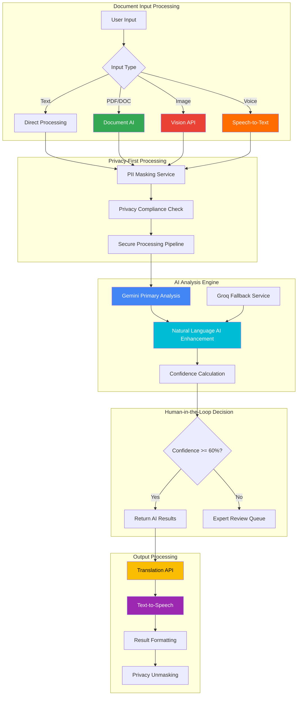
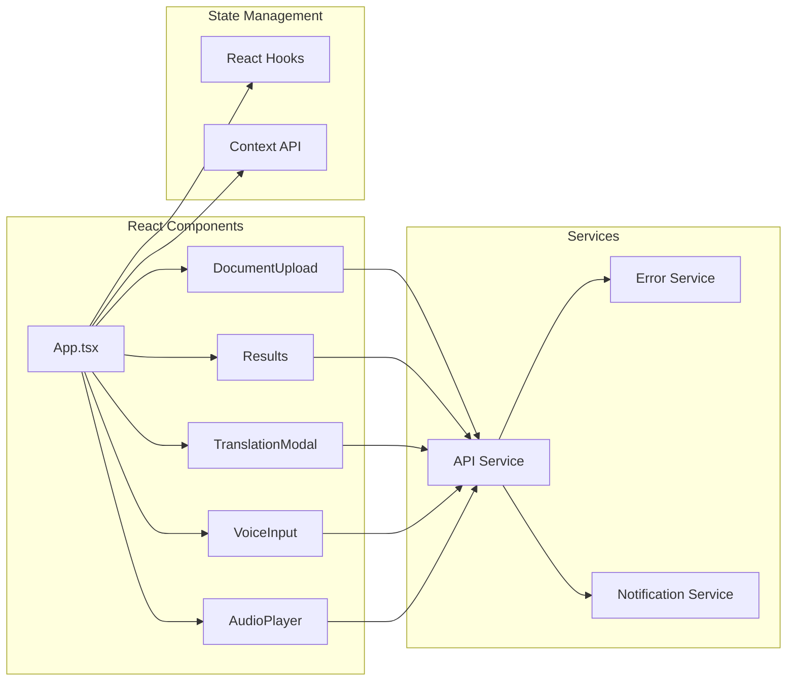
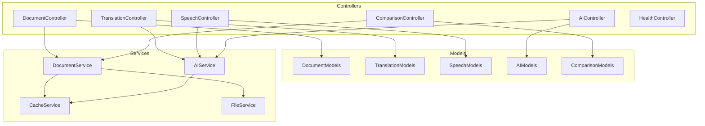
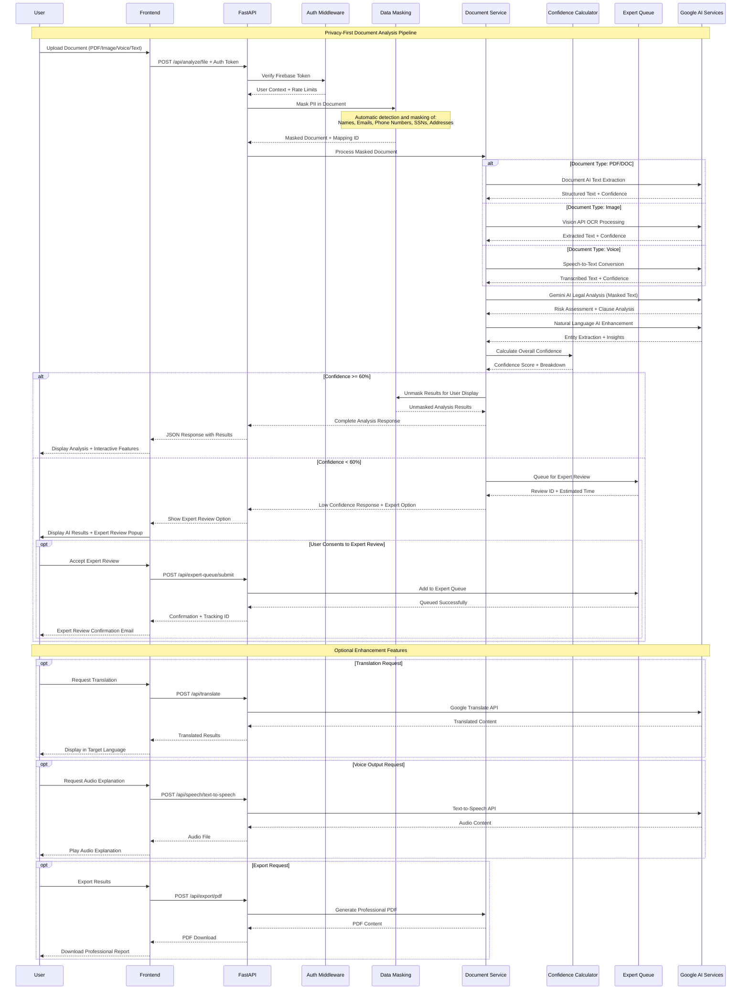
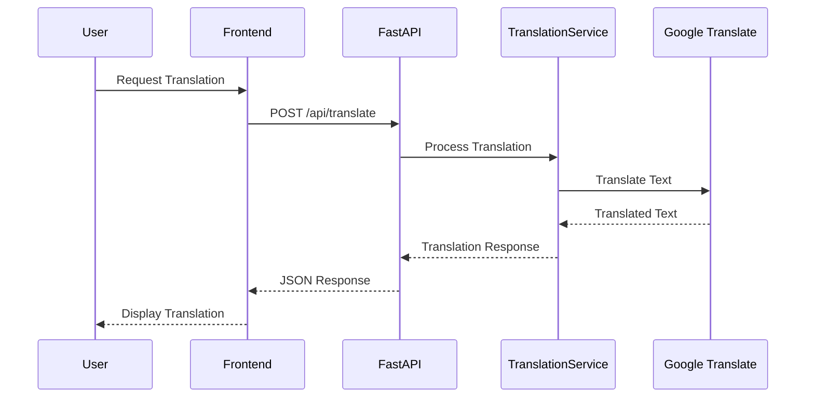
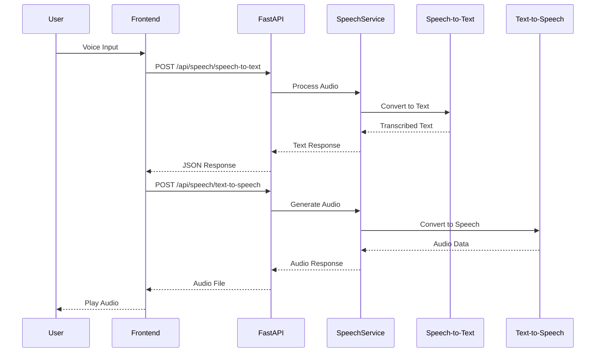
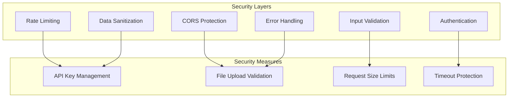
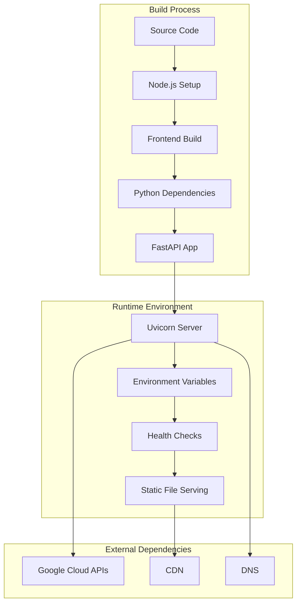
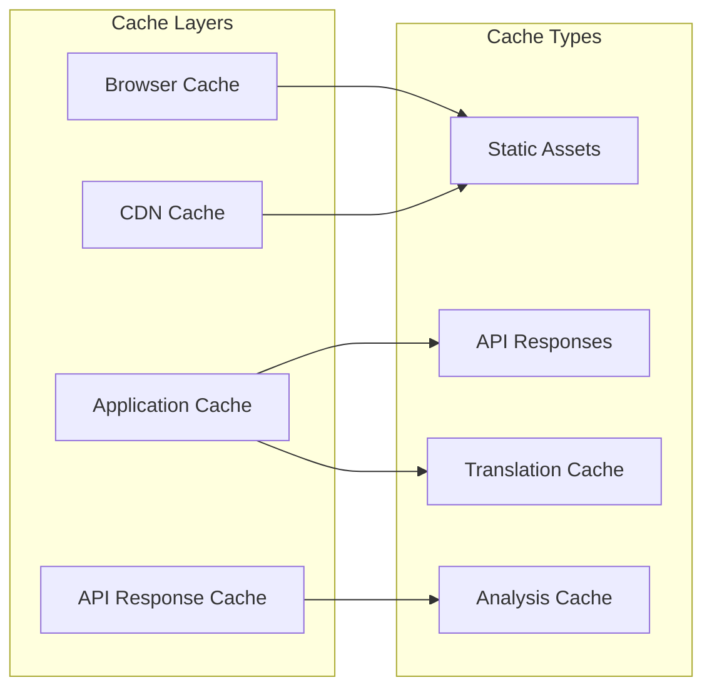

# LegalSaathi System Architecture
*Empowering Everyone to Understand Legal Documents Through AI*

## Overview

LegalSaathi is a comprehensive AI-powered legal document analysis platform that transforms complex legal documents into clear, accessible guidance. The system leverages multiple Google Cloud AI services, implements privacy-first processing, and includes a human-in-the-loop system for quality assurance. Built with modern web technologies, it provides end-to-end document analysis, multi-language support, voice accessibility, and expert review capabilities.

**Live Demo**: [https://legalsaathi-document-advisor.onrender.com](https://legalsaathi-document-advisor.onrender.com)
**GitHub Repository**: [Legal Saathi Document Advisor](https://github.com/your-repo/legal-saathi-document-advisor)

## Complete System Architecture

```mermaid
graph TB
    subgraph "User Interface Layer"
        A[React + TypeScript PWA]
        B[Firebase Auth SDK]
        C[Tailwind CSS + Responsive Design]
        D[Voice Interface Components]
    end
    
    subgraph "API Gateway & Security"
        E[FastAPI Application]
        F[Firebase Auth Middleware]
        G[User-based Rate Limiting]
        H[CORS & Security Headers]
        I[Request Validation]
    end
    
    subgraph "Controller Layer (MVC)"
        J[Document Controller]
        K[Translation Controller]
        L[Speech Controller]
        M[AI Controller]
        N[Vision Controller]
        O[Expert Queue Controller]
        P[Auth Controller]
    end
    
    subgraph "Business Logic Services"
        Q[Document Service]
        R[AI Service Multi-Engine]
        S[Confidence Calculator]
        T[Data Masking Service]
        U[Cache Service]
        V[Expert Queue Service]
    end
    
    subgraph "Google Cloud AI Services"
        W[Gemini API - Primary Analysis]
        X[Document AI - Text Extraction]
        Y[Vision API - Image OCR]
        Z[Translation API - 50+ Languages]
        AA[Speech-to-Text - Voice Input]
        BB[Text-to-Speech - Audio Output]
        CC[Natural Language AI - Entities]
    end
    
    subgraph "Human-in-the-Loop System"
        DD[Confidence Calculation]
        EE[Expert Review Queue]
        FF[Expert Dashboard]
        GG[Email Notification System]
        HH[Review Management]
    end
    
    subgraph "Privacy & Data Protection"
        II[PII Masking Engine]
        JJ[Privacy Compliance Validator]
        KK[Data Unmasking Service]
        LL[Audit Logging]
    end
    
    subgraph "Storage & Caching"
        MM[Multi-level Cache System]
        NN[Local File System]
        OO[Firebase Database]
        PP[Session Storage]
    end
    
    subgraph "External Infrastructure"
        QQ[Render.com Hosting]
        RR[CDN Distribution]
        SS[Gmail SMTP Service]
        TT[Firebase Authentication]
    end
    
    %% User Interface Connections
    A --> E
    B --> F
    D --> L
    
    %% API Gateway Connections
    E --> G
    F --> H
    G --> I
    I --> J
    I --> K
    I --> L
    I --> M
    I --> N
    I --> O
    I --> P
    
    %% Controller to Service Connections
    J --> Q
    K --> R
    L --> R
    M --> R
    N --> Y
    O --> V
    P --> TT
    
    %% Service Layer Connections
    Q --> S
    Q --> T
    R --> U
    S --> EE
    T --> II
    
    %% Google AI Service Connections
    R --> W
    Q --> X
    N --> Y
    K --> Z
    L --> AA
    L --> BB
    Q --> CC
    
    %% Human-in-the-Loop Connections
    S --> DD
    DD --> EE
    EE --> FF
    EE --> GG
    V --> HH
    
    %% Privacy System Connections
    T --> II
    II --> JJ
    JJ --> KK
    KK --> LL
    
    %% Storage Connections
    U --> MM
    Q --> NN
    F --> OO
    A --> PP
    
    %% External Service Connections
    E --> QQ
    A --> RR
    GG --> SS
    B --> TT
    
    %% Styling
    style W fill:#4285f4,color:#fff
    style X fill:#34a853,color:#fff
    style Y fill:#ea4335,color:#fff
    style Z fill:#fbbc04,color:#000
    style AA fill:#ff6d01,color:#fff
    style BB fill:#9c27b0,color:#fff
    style CC fill:#00bcd4,color:#fff
    style II fill:#f44336,color:#fff
    style EE fill:#ff9800,color:#fff
```



## Service Organization

## Google Cloud AI Services Integration

### Comprehensive AI Service Architecture

LegalSaathi leverages 6 Google Cloud AI services in a coordinated architecture:

#### 1. Google Gemini API (`services/ai_service.py`)
- **Primary Role**: Advanced legal document analysis and interpretation
- **Implementation**: Multi-service manager with Groq fallback
- **Features**:
  - Context-aware legal document understanding
  - Experience-level adaptive responses (Beginner/Intermediate/Expert)
  - Risk assessment with confidence scoring
  - Plain language explanation generation
- **Why Chosen**: Superior reasoning capabilities for complex legal interpretation
- **Value Added**: Intelligent risk assessment, personalized explanations

#### 2. Google Document AI (`services/google_document_ai_service.py`)
- **Primary Role**: Structured document processing and text extraction
- **Implementation**: Dedicated processor for legal documents
- **Features**:
  - High-accuracy OCR for PDFs and scanned documents
  - Table and form recognition
  - Legal clause identification and extraction
  - Confidence scoring for extracted content
- **Why Chosen**: Specialized for document structure understanding
- **Value Added**: Accurate text extraction, structured data recognition

#### 3. Google Cloud Vision API (`controllers/vision_controller.py`)
- **Primary Role**: Image-based document processing
- **Implementation**: Dual vision service with fallback mechanisms
- **Features**:
  - Text extraction from legal document images
  - Preprocessing for legal document optimization
  - Confidence-based text filtering
  - Support for multiple image formats (JPEG, PNG, WEBP, BMP, GIF)
- **Why Chosen**: Handles mobile photos and scanned legal documents
- **Value Added**: Accessibility for image-based document input

#### 4. Google Cloud Translation API (`services/google_translate_service.py`)
- **Primary Role**: Multi-language document translation
- **Implementation**: Legal context-aware translation service
- **Features**:
  - Neural machine translation for 50+ languages
  - Legal terminology preservation
  - Cultural legal system adaptation
  - Clause-level translation with context
- **Why Chosen**: Maintains legal meaning across languages
- **Value Added**: Global accessibility, legal context preservation

#### 5. Google Cloud Speech-to-Text (`services/google_speech_service.py`)
- **Primary Role**: Voice accessibility for document input
- **Implementation**: Enhanced speech service with legal terminology
- **Features**:
  - Legal terminology recognition
  - Automatic punctuation and formatting
  - Multi-language support (13+ languages)
  - Real-time transcription capabilities
- **Why Chosen**: Accessibility for users with disabilities
- **Value Added**: Inclusive document input, hands-free operation

#### 6. Google Cloud Text-to-Speech (`services/google_speech_service.py`)
- **Primary Role**: Audio accessibility for analysis results
- **Implementation**: Neural voice synthesis with customization
- **Features**:
  - Natural-sounding neural voices
  - Adjustable speaking rate and pitch
  - Multi-language voice options
  - Legal content optimization
- **Why Chosen**: Accessibility for visually impaired users
- **Value Added**: Inclusive result delivery, audio learning

#### 7. Google Cloud Natural Language AI (`services/google_natural_language_service.py`)
- **Primary Role**: Advanced text analysis and entity extraction
- **Implementation**: Legal-specific entity recognition
- **Features**:
  - Legal entity extraction (parties, dates, amounts)
  - Sentiment analysis for legal tone
  - Syntax analysis for complexity scoring
  - Content classification for document types
- **Why Chosen**: Deep text understanding beyond basic analysis
- **Value Added**: Enhanced insights, entity relationship mapping

### AI Service Coordination Architecture



### MVC Architecture Pattern

#### Controllers (`controllers/`)
- **Document Controller**: Handles document upload and analysis requests
- **Translation Controller**: Manages translation requests and language support
- **Speech Controller**: Processes voice input/output operations
- **AI Controller**: Manages AI clarification and conversation features
- **Health Controller**: Provides system health monitoring and diagnostics

#### Models (`models/`)
- **Pydantic Models**: Type-safe data validation and serialization
- **Request/Response Schemas**: Structured API contracts
- **Enum Definitions**: Standardized value sets for consistency

#### Services (`services/`)
- **Business Logic**: Core application functionality
- **Google Cloud Integration**: Dedicated services for each AI capability
- **Caching and Performance**: Optimized data access and storage
- **File Processing**: Document parsing and content extraction

## Component Architecture

### Frontend Architecture



### Backend Architecture (MVC Pattern)



## API Architecture


```mermaid
graph LR
    subgraph "API Endpoints"
        A[/api/analyze]
        B[/api/translate]
        C[/api/speech/*]
        D[/api/ai/clarify]
        E[/api/compare]
        F[/health]
    end
    
    subgraph "HTTP Methods"
        G[POST]
        H[GET]
        I[DELETE]
    end
    
    subgraph "Response Formats"
        J[JSON]
        K[Binary Audio]
        L[PDF Export]
    end
    
    A --> G
    B --> G
    C --> G
    C --> H
    D --> G
    E --> G
    F --> H
    
    A --> J
    B --> J
    C --> J
    C --> K
    D --> J
    E --> J
    E --> L
    F --> J
```

## Complete Data Flow Architecture

### Privacy-First Document Analysis Flow



### Translation Flow



### Speech Processing Flow



## Security Architecture

### Security Layers



## Deployment Architecture

### Render.com Deployment



## Performance Optimization

### Caching Strategy



## Scalability Considerations

### Horizontal Scaling

- **Stateless Design**: All services are stateless for easy horizontal scaling
- **Load Balancing**: FastAPI supports multiple workers
- **Caching**: Reduces API calls and improves response times
- **Async Processing**: Non-blocking operations for better throughput

### Vertical Scaling

- **Resource Optimization**: Efficient memory and CPU usage
- **Connection Pooling**: Optimized database and API connections
- **Compression**: GZip compression for reduced bandwidth
- **Monitoring**: Performance metrics and health checks

## Complete Technology Stack

### Frontend Technologies
```yaml
Core Framework:
  - React 18: Modern UI with concurrent features and hooks
  - TypeScript: Type-safe development with enhanced IDE support
  - Vite: Lightning-fast HMR and optimized production builds

Styling & UI:
  - Tailwind CSS: Utility-first responsive design system
  - Progressive Web App: Service worker + offline capabilities
  - Responsive Design: Mobile-first approach with breakpoints

State Management:
  - React Hooks: useState, useEffect, useContext for local state
  - Context API: Global state for authentication and user preferences
  - Custom Hooks: Reusable logic for API calls and data management

Authentication:
  - Firebase SDK: Client-side authentication and token management
  - Automatic Token Refresh: Seamless session management
  - Protected Routes: Route-level authentication guards
```

### Backend Technologies
```yaml
Core Framework:
  - FastAPI: Modern Python web framework with automatic OpenAPI docs
  - Python 3.12: Latest Python with performance improvements
  - Uvicorn: High-performance ASGI server for production

Architecture Pattern:
  - MVC Pattern: Clean separation of controllers, models, and services
  - Dependency Injection: Service layer with proper abstraction
  - Async/Await: Non-blocking operations for better performance

Data Validation:
  - Pydantic Models: Type-safe request/response validation
  - Custom Validators: Legal document specific validation rules
  - Error Handling: Comprehensive exception handling with user-friendly messages

Middleware Stack:
  - Firebase Auth Middleware: Server-side token verification
  - Rate Limiting: User-based limits with SlowAPI
  - CORS Middleware: Cross-origin request handling
  - GZip Compression: Response compression for better performance
  - Security Headers: HTTPS enforcement and security policies
```

### Google Cloud AI Integration
```yaml
Primary AI Services:
  - Gemini API: Advanced legal document analysis and interpretation
  - Document AI: Structured document processing and OCR
  - Vision API: Image-based document text extraction
  - Translation API: Multi-language translation with legal context
  - Speech-to-Text: Voice input with legal terminology recognition
  - Text-to-Speech: Neural voice synthesis for accessibility
  - Natural Language AI: Entity extraction and text analysis

Service Architecture:
  - Multi-Service Manager: Intelligent routing between AI services
  - Fallback Systems: Groq API backup for high availability
  - Confidence Scoring: Quality assessment for each AI response
  - Cost Monitoring: Usage tracking and optimization
  - Rate Limiting: Service-specific quotas and throttling
```

### Privacy & Security Stack
```yaml
Data Protection:
  - PII Masking Engine: Automatic detection and masking of sensitive data
  - Privacy Compliance: GDPR-compliant data processing
  - Data Unmasking: Secure restoration for user display
  - Audit Logging: Complete privacy operation tracking

Security Measures:
  - Firebase Authentication: Secure token-based authentication
  - Input Validation: Comprehensive request sanitization
  - File Upload Security: Type validation and size limits
  - API Security: Rate limiting and request throttling
  - HTTPS Enforcement: End-to-end encryption
```

### Infrastructure & DevOps
```yaml
Hosting & Deployment:
  - Render.com: Auto-deploy from Git with zero-downtime updates
  - CDN Integration: Global static asset distribution
  - Health Monitoring: Automated health checks and alerting
  - Performance Metrics: Real-time application monitoring

Caching Strategy:
  - Multi-Level Caching: Analysis (1hr), Translation (24hr), Speech (6hr)
  - Cache Invalidation: TTL-based and manual cache clearing
  - Performance Optimization: Reduced API calls and faster responses

Development Tools:
  - Git Version Control: Feature branch workflow
  - GitHub Actions: CI/CD pipeline with automated testing
  - ESLint + Prettier: Code quality and formatting
  - Pytest: Comprehensive backend testing
  - Type Checking: TypeScript and Python type validation
```

### Database & Storage
```yaml
Data Storage:
  - Firebase Database: User authentication and profile data
  - Local File System: Temporary document processing
  - Session Storage: Client-side temporary data
  - Cache Storage: Multi-level caching system

File Processing:
  - Temporary File Handling: Secure upload and processing
  - Format Support: PDF, DOC, DOCX, TXT, Images (JPEG, PNG, WEBP, BMP, GIF)
  - Size Limits: 20MB for documents, 10MB for audio
  - Cleanup Procedures: Automatic temporary file removal
```

### Performance & Scalability
```yaml
Performance Optimization:
  - Async Processing: Non-blocking operations throughout
  - Parallel API Calls: Concurrent Google AI service requests
  - Connection Pooling: Optimized external API connections
  - Response Compression: GZip compression for all responses
  - Bundle Optimization: Code splitting and lazy loading

Scalability Features:
  - Stateless Design: Horizontal scaling ready
  - Load Balancing: Multiple worker support
  - Auto-scaling: Resource-based scaling policies
  - Monitoring: Performance metrics and alerting
  - Circuit Breakers: Automatic failover mechanisms
```

### Quality Assurance
```yaml
Testing Strategy:
  - Unit Tests: Individual component and function testing
  - Integration Tests: End-to-end workflow validation
  - API Testing: Comprehensive endpoint testing
  - Performance Testing: Load testing and optimization
  - Security Testing: Vulnerability assessment

Code Quality:
  - Type Safety: TypeScript and Pydantic validation
  - Linting: ESLint for JavaScript/TypeScript
  - Formatting: Prettier for consistent code style
  - Documentation: Comprehensive API and code documentation
  - Code Reviews: Peer review process for all changes
```