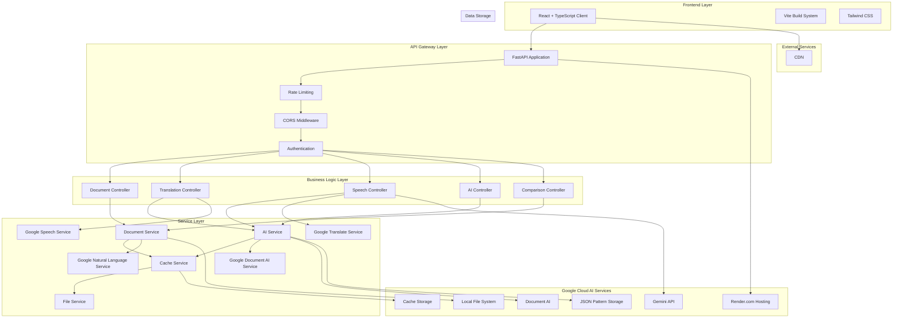
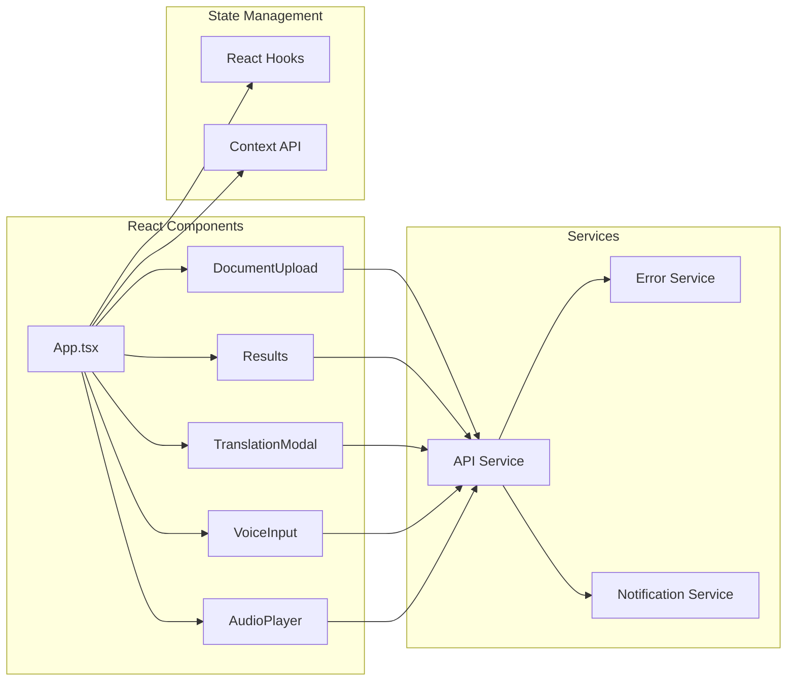
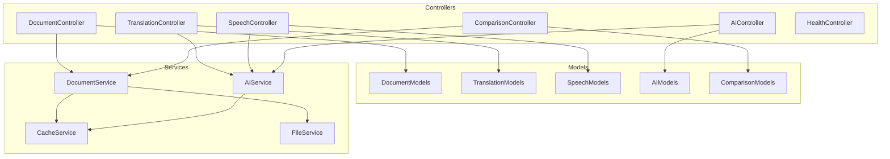
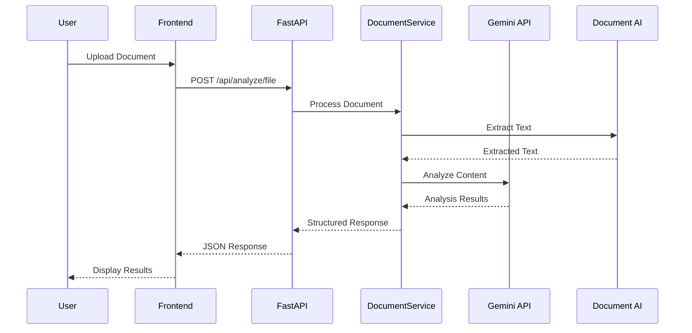
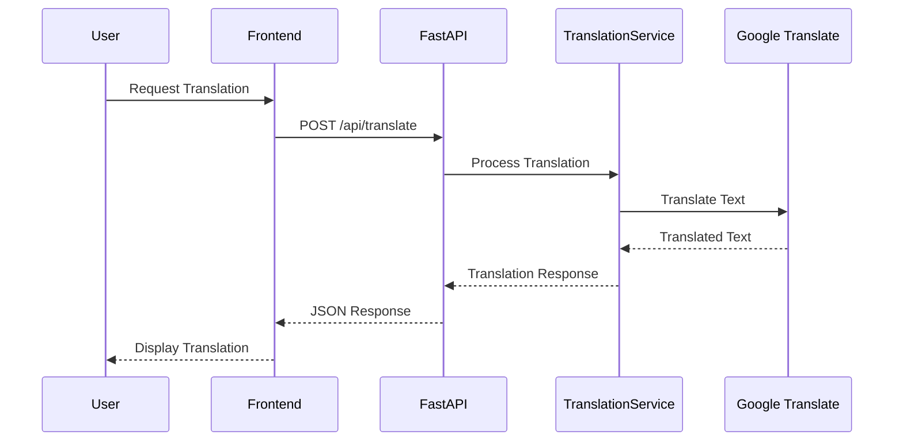
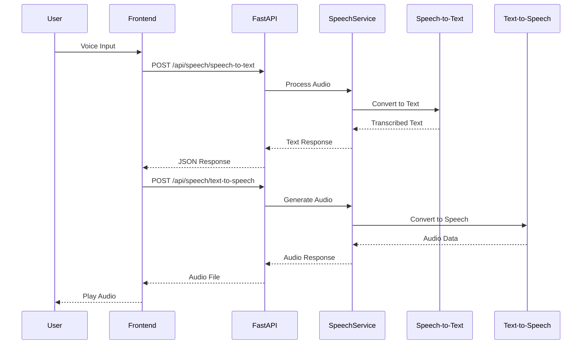
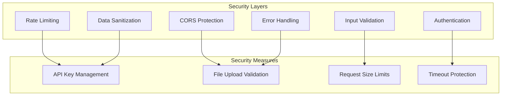
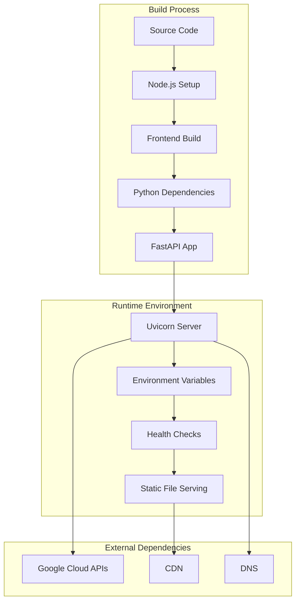
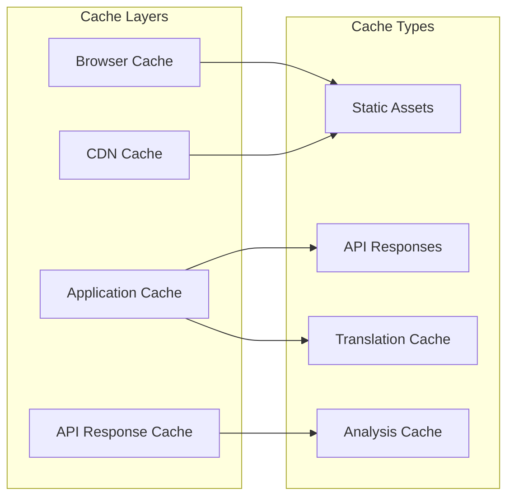

# LegalSaathi System Architecture

## Overview

LegalSaathi is an AI-powered legal document analysis platform that simplifies complex legal documents into clear, accessible guidance. The system uses Google Cloud AI services and modern web technologies to provide comprehensive document analysis, translation, and speech capabilities.

## System Architecture Diagram



## Service Organization

### Google Cloud Services Integration

The application integrates with multiple Google Cloud AI services through dedicated service classes:

#### `services/google_document_ai_service.py`
- **Purpose**: Document processing and OCR capabilities
- **Features**: 
  - Structured data extraction from legal documents
  - Entity recognition and table extraction
  - Legal clause identification
  - Confidence scoring and quality assessment

#### `services/google_natural_language_service.py`
- **Purpose**: Advanced text analysis and understanding
- **Features**:
  - Sentiment analysis for legal tone assessment
  - Named entity extraction for legal entities
  - Syntax analysis for complexity scoring
  - Content classification for document categorization

#### `services/google_speech_service.py`
- **Purpose**: Voice input and output capabilities
- **Features**:
  - Speech-to-text with legal terminology support
  - Text-to-speech with neural voices
  - Multi-language support (13+ languages)
  - Real-time streaming transcription

#### `services/google_translate_service.py`
- **Purpose**: Multi-language translation support
- **Features**:
  - Neural machine translation for 50+ languages
  - Legal context-aware translation
  - Clause-level translation precision
  - Fallback translation mechanisms

### MVC Architecture Pattern

#### Controllers (`controllers/`)
- **Document Controller**: Handles document upload and analysis requests
- **Translation Controller**: Manages translation requests and language support
- **Speech Controller**: Processes voice input/output operations
- **AI Controller**: Manages AI clarification and conversation features
- **Health Controller**: Provides system health monitoring and diagnostics

#### Models (`models/`)
- **Pydantic Models**: Type-safe data validation and serialization
- **Request/Response Schemas**: Structured API contracts
- **Enum Definitions**: Standardized value sets for consistency

#### Services (`services/`)
- **Business Logic**: Core application functionality
- **Google Cloud Integration**: Dedicated services for each AI capability
- **Caching and Performance**: Optimized data access and storage
- **File Processing**: Document parsing and content extraction

## Component Architecture

### Frontend Architecture



### Backend Architecture (MVC Pattern)



## API Architecture

### RESTful API Design

```mermaid
graph LR
    subgraph "API Endpoints"
        A[/api/analyze]
        B[/api/translate]
        C[/api/speech/*]
        D[/api/ai/clarify]
        E[/api/compare]
        F[/health]
    end
    
    subgraph "HTTP Methods"
        G[POST]
        H[GET]
        I[DELETE]
    end
    
    subgraph "Response Formats"
        J[JSON]
        K[Binary Audio]
        L[PDF Export]
    end
    
    A --> G
    B --> G
    C --> G
    C --> H
    D --> G
    E --> G
    F --> H
    
    A --> J
    B --> J
    C --> J
    C --> K
    D --> J
    E --> J
    E --> L
    F --> J
```

## Data Flow Architecture

### Document Analysis Flow



### Translation Flow



### Speech Processing Flow



## Security Architecture

### Security Layers



## Deployment Architecture

### Render.com Deployment



## Performance Optimization

### Caching Strategy



## Scalability Considerations

### Horizontal Scaling

- **Stateless Design**: All services are stateless for easy horizontal scaling
- **Load Balancing**: FastAPI supports multiple workers
- **Caching**: Reduces API calls and improves response times
- **Async Processing**: Non-blocking operations for better throughput

### Vertical Scaling

- **Resource Optimization**: Efficient memory and CPU usage
- **Connection Pooling**: Optimized database and API connections
- **Compression**: GZip compression for reduced bandwidth
- **Monitoring**: Performance metrics and health checks

## Technology Stack

### Frontend
- **React 18**: Modern UI framework with hooks
- **TypeScript**: Type-safe JavaScript
- **Vite**: Fast build tool and dev server
- **Tailwind CSS**: Utility-first CSS framework

### Backend
- **FastAPI**: Modern Python web framework
- **Uvicorn**: ASGI server for production
- **Pydantic**: Data validation and serialization
- **SlowAPI**: Rate limiting middleware

### AI Services
- **Google Gemini**: Advanced language model
- **Document AI**: Document processing and OCR
- **Translation API**: Multi-language translation
- **Speech Services**: Speech-to-text and text-to-speech
- **Natural Language AI**: Text analysis and understanding

### Infrastructure
- **Render.com**: Cloud hosting platform
- **Node.js**: JavaScript runtime for build process
- **Python 3.12**: Backend runtime environment