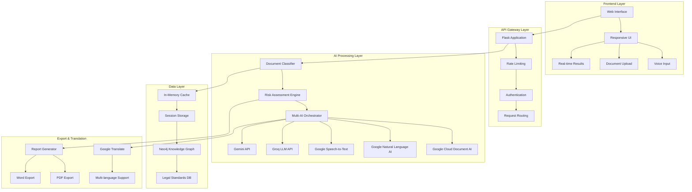

# Technical Architecture Documentation
## LegalSaathi Document Advisor - Scalable AI Platform

### 🏗️ System Architecture Overview



### 🔧 Core Components Architecture

#### 1. Application Server (Flask)
```python
# High-level application structure
app = Flask(__name__)
├── Configuration Management
├── Middleware Stack
│   ├── Rate Limiting
│   ├── CORS Handling
│   ├── Error Handling
│   └── Logging
├── Route Handlers
│   ├── Document Analysis
│   ├── AI Clarification
│   ├── Export Services
│   └── Health Monitoring
└── Service Integrations
```

#### 2. AI Service Orchestrator
```python
class AIServiceOrchestrator:
    """
    Manages multiple AI services with intelligent fallback
    """
    def __init__(self):
        self.services = {
            'primary': [GoogleDocumentAI, GoogleNaturalLanguage],
            'secondary': [GroqAPI, GeminiAPI],
            'fallback': [KeywordBasedAnalysis]
        }
    
    def analyze_document(self, document):
        for service_tier in self.services.values():
            try:
                return self.execute_analysis(service_tier, document)
            except ServiceException:
                continue  # Fallback to next tier
```

#### 3. Risk Assessment Engine
```python
class EnhancedRiskAssessment:
    """
    Multi-dimensional risk analysis with confidence scoring
    """
    risk_categories = {
        'financial': FinancialRiskAnalyzer,
        'legal': LegalRiskAnalyzer,
        'operational': OperationalRiskAnalyzer,
        'reputational': ReputationalRiskAnalyzer
    }
    
    def assess_risk(self, clause, document_type):
        risk_scores = {}
        confidence_factors = []
        
        for category, analyzer in self.risk_categories.items():
            score, confidence = analyzer.analyze(clause, document_type)
            risk_scores[category] = score
            confidence_factors.append(confidence)
        
        return RiskAssessment(
            overall_score=self.calculate_weighted_score(risk_scores),
            confidence=self.calculate_confidence(confidence_factors),
            categories=risk_scores
        )
```

### 🚀 Scalability & Performance Architecture

#### Horizontal Scaling Design
```yaml
Load Balancer:
  type: "nginx"
  algorithm: "round_robin"
  health_checks: "/health"
  
Application Instances:
  min_instances: 2
  max_instances: 10
  auto_scaling:
    cpu_threshold: 70%
    memory_threshold: 80%
    response_time_threshold: 30s

Caching Strategy:
  level_1: "In-Memory (Redis)"
  level_2: "Application Cache"
  level_3: "CDN (Static Assets)"
  
Database:
  primary: "Neo4j Cluster"
  read_replicas: 3
  backup_strategy: "Continuous"
```

#### Performance Optimization
```python
# Caching Implementation
class PerformanceOptimizer:
    def __init__(self):
        self.cache_layers = {
            'analysis_results': TTLCache(maxsize=1000, ttl=3600),
            'document_embeddings': LRUCache(maxsize=5000),
            'translation_cache': TTLCache(maxsize=2000, ttl=7200)
        }
    
    @cached(cache='analysis_results')
    def get_analysis(self, document_hash):
        return self.perform_analysis(document_hash)
    
    def cache_warming(self):
        """Pre-populate cache with common document patterns"""
        common_patterns = self.get_common_patterns()
        for pattern in common_patterns:
            self.get_analysis(pattern.hash)
```

### 🔒 Security Architecture

#### Multi-Layer Security Model
```python
class SecurityFramework:
    """
    Comprehensive security implementation
    """
    def __init__(self):
        self.security_layers = [
            InputSanitizer(),
            RateLimiter(),
            AuthenticationManager(),
            EncryptionHandler(),
            AuditLogger()
        ]
    
    def process_request(self, request):
        for layer in self.security_layers:
            request = layer.process(request)
            if layer.should_block(request):
                raise SecurityException(layer.get_reason())
        return request
```

#### Data Privacy Implementation
```python
class PrivacyManager:
    """
    GDPR-compliant data handling
    """
    def process_document(self, document_text):
        # 1. Process in memory only
        analysis_result = self.analyze_in_memory(document_text)
        
        # 2. Anonymize any stored metadata
        metadata = self.anonymize_metadata(analysis_result.metadata)
        
        # 3. Set automatic cleanup
        self.schedule_cleanup(analysis_result.id, ttl=3600)
        
        return analysis_result
    
    def anonymize_metadata(self, metadata):
        """Remove any potentially identifying information"""
        return {
            'document_type': metadata.get('type'),
            'analysis_timestamp': metadata.get('timestamp'),
            'risk_level': metadata.get('risk_level')
            # Exclude: user_ip, document_content, personal_data
        }
```

### 🤖 AI Integration Architecture

#### Google Cloud AI Services Integration
```python
class GoogleCloudAIManager:
    """
    Unified Google Cloud AI services management
    """
    def __init__(self):
        self.services = {
            'document_ai': GoogleDocumentAIService(),
            'natural_language': GoogleNaturalLanguageService(),
            'speech_to_text': GoogleSpeechService(),
            'translation': GoogleTranslateService()
        }
        self.fallback_chain = self.build_fallback_chain()
    
    def process_document(self, document, document_bytes=None):
        results = {}
        
        # Parallel processing for performance
        with ThreadPoolExecutor(max_workers=4) as executor:
            futures = {
                'structure': executor.submit(
                    self.services['document_ai'].process_legal_document,
                    document_bytes
                ),
                'language': executor.submit(
                    self.services['natural_language'].analyze_legal_document,
                    document
                ),
                'translation': executor.submit(
                    self.services['translation'].detect_language,
                    document
                )
            }
            
            for service, future in futures.items():
                try:
                    results[service] = future.result(timeout=30)
                except Exception as e:
                    results[service] = self.get_fallback_result(service, e)
        
        return self.merge_ai_results(results)
```

#### Intelligent Fallback System
```python
class FallbackManager:
    """
    Multi-tier fallback system for high availability
    """
    def __init__(self):
        self.fallback_tiers = [
            # Tier 1: Primary AI Services
            [GroqAPI(), GeminiAPI()],
            # Tier 2: Alternative AI Services
            [OpenAIAPI(), AnthropicAPI()],
            # Tier 3: Rule-based Analysis
            [KeywordAnalyzer(), PatternMatcher()],
            # Tier 4: Basic Analysis
            [SimpleRiskClassifier()]
        ]
    
    def execute_with_fallback(self, operation, *args, **kwargs):
        for tier_index, tier in enumerate(self.fallback_tiers):
            for service in tier:
                try:
                    result = service.execute(operation, *args, **kwargs)
                    self.log_success(service, tier_index)
                    return result
                except Exception as e:
                    self.log_failure(service, tier_index, e)
                    continue
        
        raise AllServicesFailedException("All fallback tiers exhausted")
```

### 📊 Monitoring & Observability

#### Comprehensive Monitoring Stack
```python
class MonitoringSystem:
    """
    Real-time system monitoring and alerting
    """
    def __init__(self):
        self.metrics = {
            'performance': PerformanceMetrics(),
            'availability': AvailabilityMetrics(),
            'security': SecurityMetrics(),
            'business': BusinessMetrics()
        }
        self.alerting = AlertingSystem()
    
    def collect_metrics(self):
        return {
            'response_times': self.metrics['performance'].get_response_times(),
            'error_rates': self.metrics['availability'].get_error_rates(),
            'security_events': self.metrics['security'].get_events(),
            'user_analytics': self.metrics['business'].get_analytics()
        }
    
    def check_health(self):
        health_status = {}
        for component in self.get_critical_components():
            try:
                health_status[component.name] = component.health_check()
            except Exception as e:
                health_status[component.name] = {
                    'status': 'unhealthy',
                    'error': str(e)
                }
                self.alerting.send_alert(component, e)
        
        return health_status
```

#### Performance Metrics Collection
```python
class PerformanceTracker:
    """
    Detailed performance analytics
    """
    def __init__(self):
        self.metrics_store = MetricsStore()
        self.real_time_dashboard = Dashboard()
    
    @measure_time
    def track_analysis_performance(self, document_type, user_expertise):
        start_time = time.time()
        
        # Track individual component performance
        component_times = {}
        component_times['preprocessing'] = self.measure_preprocessing()
        component_times['ai_analysis'] = self.measure_ai_analysis()
        component_times['risk_assessment'] = self.measure_risk_assessment()
        component_times['report_generation'] = self.measure_report_generation()
        
        total_time = time.time() - start_time
        
        # Store metrics for analysis
        self.metrics_store.record({
            'total_time': total_time,
            'component_times': component_times,
            'document_type': document_type,
            'user_expertise': user_expertise,
            'timestamp': datetime.utcnow()
        })
        
        # Update real-time dashboard
        self.real_time_dashboard.update_metrics(component_times)
```

### 🔄 Data Flow Architecture

#### Document Processing Pipeline
```python
class DocumentProcessingPipeline:
    """
    Streamlined document processing workflow
    """
    def __init__(self):
        self.stages = [
            InputValidationStage(),
            DocumentClassificationStage(),
            TextPreprocessingStage(),
            AIAnalysisStage(),
            RiskAssessmentStage(),
            ReportGenerationStage(),
            CachingStage()
        ]
    
    def process(self, document_input):
        context = ProcessingContext(document_input)
        
        for stage in self.stages:
            try:
                context = stage.execute(context)
                self.log_stage_completion(stage, context)
            except StageException as e:
                return self.handle_stage_error(stage, context, e)
        
        return context.get_final_result()
    
    def handle_stage_error(self, failed_stage, context, error):
        """Graceful error handling with partial results"""
        if context.has_partial_results():
            return context.get_partial_result_with_warning(error)
        else:
            raise ProcessingFailedException(failed_stage, error)
```

### 🌐 API Design Architecture

#### RESTful API Structure
```python
# API Endpoint Organization
/api/v1/
├── /analyze                    # Document analysis
│   ├── POST /                 # Submit document for analysis
│   ├── GET /{analysis_id}     # Get analysis results
│   └── DELETE /{analysis_id}  # Delete analysis (privacy)
├── /clarify                   # AI clarification
│   ├── POST /                 # Ask clarification question
│   └── GET /conversation      # Get conversation history
├── /export                    # Report export
│   ├── GET /pdf/{analysis_id} # Export PDF report
│   └── GET /docx/{analysis_id}# Export Word report
├── /translate                 # Translation services
│   ├── POST /text             # Translate text
│   └── GET /languages         # Supported languages
├── /health                    # System health
│   ├── GET /                  # Overall health status
│   └── GET /detailed          # Detailed component health
└── /metrics                   # Performance metrics
    ├── GET /                  # Current metrics
    └── GET /historical        # Historical data
```

#### API Response Standards
```python
class APIResponseStandard:
    """
    Consistent API response format
    """
    @staticmethod
    def success_response(data, message="Success"):
        return {
            "success": True,
            "message": message,
            "data": data,
            "timestamp": datetime.utcnow().isoformat(),
            "version": "v1"
        }
    
    @staticmethod
    def error_response(error_code, message, details=None):
        return {
            "success": False,
            "error": {
                "code": error_code,
                "message": message,
                "details": details
            },
            "timestamp": datetime.utcnow().isoformat(),
            "version": "v1"
        }
```

### 🔧 Configuration Management

#### Environment-Based Configuration
```python
class ConfigurationManager:
    """
    Centralized configuration management
    """
    def __init__(self):
        self.config = self.load_configuration()
        self.validate_configuration()
    
    def load_configuration(self):
        return {
            'ai_services': {
                'google_cloud': {
                    'project_id': os.getenv('GOOGLE_CLOUD_PROJECT_ID'),
                    'credentials_path': os.getenv('GOOGLE_APPLICATION_CREDENTIALS'),
                    'location': os.getenv('GOOGLE_CLOUD_LOCATION', 'us')
                },
                'groq': {
                    'api_key': os.getenv('GROQ_API_KEY'),
                    'model': os.getenv('GROQ_MODEL', 'llama-3.1-8b-instant'),
                    'timeout': int(os.getenv('GROQ_TIMEOUT', '30'))
                },
                'gemini': {
                    'api_key': os.getenv('GEMINI_API_KEY'),
                    'model': os.getenv('GEMINI_MODEL', 'gemini-pro'),
                    'safety_settings': self.get_safety_settings()
                }
            },
            'performance': {
                'cache_ttl': int(os.getenv('CACHE_TTL', '3600')),
                'rate_limit': int(os.getenv('RATE_LIMIT', '10')),
                'max_document_size': int(os.getenv('MAX_DOC_SIZE', '50000'))
            },
            'security': {
                'encryption_key': os.getenv('ENCRYPTION_KEY'),
                'session_timeout': int(os.getenv('SESSION_TIMEOUT', '1800')),
                'max_login_attempts': int(os.getenv('MAX_LOGIN_ATTEMPTS', '5'))
            }
        }
```

### 📈 Scalability Considerations

#### Auto-Scaling Strategy
```yaml
# Kubernetes Deployment Configuration
apiVersion: apps/v1
kind: Deployment
metadata:
  name: legal-saathi-api
spec:
  replicas: 3
  selector:
    matchLabels:
      app: legal-saathi-api
  template:
    spec:
      containers:
      - name: api
        image: legal-saathi:latest
        resources:
          requests:
            memory: "512Mi"
            cpu: "250m"
          limits:
            memory: "1Gi"
            cpu: "500m"
        env:
        - name: GOOGLE_APPLICATION_CREDENTIALS
          value: "/secrets/google-credentials.json"
        volumeMounts:
        - name: google-credentials
          mountPath: "/secrets"
          readOnly: true

---
apiVersion: autoscaling/v2
kind: HorizontalPodAutoscaler
metadata:
  name: legal-saathi-hpa
spec:
  scaleTargetRef:
    apiVersion: apps/v1
    kind: Deployment
    name: legal-saathi-api
  minReplicas: 2
  maxReplicas: 20
  metrics:
  - type: Resource
    resource:
      name: cpu
      target:
        type: Utilization
        averageUtilization: 70
  - type: Resource
    resource:
      name: memory
      target:
        type: Utilization
        averageUtilization: 80
```

### 🔍 Testing Architecture

#### Multi-Layer Testing Strategy
```python
class TestingFramework:
    """
    Comprehensive testing architecture
    """
    def __init__(self):
        self.test_layers = {
            'unit': UnitTestSuite(),
            'integration': IntegrationTestSuite(),
            'performance': PerformanceTestSuite(),
            'security': SecurityTestSuite(),
            'end_to_end': E2ETestSuite()
        }
    
    def run_full_test_suite(self):
        results = {}
        for layer_name, test_suite in self.test_layers.items():
            results[layer_name] = test_suite.run()
            if not results[layer_name].passed:
                self.handle_test_failure(layer_name, results[layer_name])
        
        return TestResults(results)
    
    def continuous_testing(self):
        """Automated testing pipeline"""
        while True:
            # Run smoke tests every 5 minutes
            self.run_smoke_tests()
            time.sleep(300)
            
            # Run full suite every hour
            if datetime.now().minute == 0:
                self.run_full_test_suite()
```

This technical architecture provides a robust, scalable, and maintainable foundation for the LegalSaathi Document Advisor platform, ensuring high performance, security, and reliability while supporting future growth and feature expansion.